# V2 Architecture — AI-Native Software Engineering Foundation

Status: **Accepted for implementation**
Revision: 1 (Phase 1 RFC)
Supersedes: nothing. Extends `docs/ARCHITECTURE.md` and `docs/TASK_CONTRACT.md`.
Normative conflicts are resolved by `AGENTS.md` first, then this document.

---

## 0. How to read this document

This RFC is written to be **implementable**. It contains:

- normative statements marked **MUST** / **MUST NOT** / **SHOULD** / **MAY**;
- the concrete data shapes used by the Phase 2 domain skeleton in `src/`;
- explicit "deferred" markers where a capability is designed but not built yet.

**Design is not implementation.** Anything described here but absent from `src/` is
_maybe designed, not built_. The final report of this change records exactly which
parts of this document exist as code today.

### Document conventions

| Marker     | Meaning                                                    |
| ---------- | ---------------------------------------------------------- |
| **MUST**   | Architectural invariant. Breaking it breaks the design.    |
| **SHOULD** | Strong default. Deviate only with a recorded reason (ADR). |
| **MAY**    | Optional extension point.                                  |
| `Deferred` | Designed, deliberately not implemented in this phase.      |
| `Phase N`  | Implementation phase from §33.                             |

---

## 1. Vision

`ai-coding-base` today is a **workspace baseline**: an agent contract (`AGENTS.md`),
a task contract (`docs/TASK_CONTRACT.md`), a deterministic verification pipeline
(`scripts/verify.sh`), and a minimal TypeScript proof.

V2 turns it into a **reusable, AI-native software engineering foundation**: the
codebase you clone to start a _new_ project, which gives that project — for free —
task traceability, reproducibility, AI cost/token observability, isolation,
security, and human control.

The platform is **infrastructure**, not an agent and not an application.

### 1.1 The problem V2 solves

Working with AI agents on real software today fails in predictable ways:

1. **Cost blindness.** Nobody knows what a task cost in tokens or dollars until the invoice arrives.
2. **No traceability.** A merged change cannot be traced back to the task, the context, the decisions, and the model calls that produced it.
3. **Context waste.** Agents are handed whole repositories, burning tokens on irrelevant files.
4. **Inconsistency.** Every project reinvents prompts, policies, and verification.
5. **Unbounded autonomy.** High-risk operations (destructive DB work, auth changes, production deploys) are one tool call away from an unreviewed LLM.
6. **Vendor lock-in.** Agent frameworks and model providers leak into core logic.
7. **Leaky isolation.** Project A's memory, secrets, and telemetry bleed into project B.

### 1.2 What V2 is

- A **foundation/reference implementation** that other repositories are cloned from.
- A **provider-agnostic core** with adapters for LLMs, decision engines, storage, and sandboxes.
- A **measurement system**: every task produces tokens, cost, latency, decisions, and a replayable trace.
- A **policy and risk-aware execution model** where the human stays the owner.

### 1.3 What V2 is not

- **Not a replacement for software engineers.** It makes human + AI engineering more efficient and measurable. Humans own approval, architecture, and high-risk decisions.
- **Not an all-in-one agent framework.** No agent loop, no prompt library, no model SDK is baked into `core/`.
- **Not a hosted service.** The core must run as a local CLI/library with no server, no database, and no network dependency.
- **Not a dashboard-first product.** §26 is explicitly deferred.
- **Not a monorepo/package-manager migration.** The existing pnpm + TypeScript + Vitest toolchain is retained.

### 1.4 Success criteria for V2 (measurable)

| Criterion            | Target                                                                    |
| -------------------- | ------------------------------------------------------------------------- |
| Cost observability   | Any completed task yields token/cost/call/decision metrics _from events_  |
| Context efficiency   | Context selection is deterministic, budgeted, and unit-testable           |
| Traceability         | Task → Session → Decision/LLM/Tool/Test → Event is an unbroken chain      |
| Provider replacement | Swapping LLM provider or JEV is a config + adapter change, no core edit   |
| Isolation            | Cross-project data access requires an explicit grant                      |
| Human control        | Every `high`/`critical` risk operation is gated on explicit approval      |
| Lightweight core     | `pnpm test && pnpm typecheck` work offline with zero runtime dependencies |
| Reproducibility      | Given an event log + checkpoints, a task's decision path is replayable    |

---

## 2. Design principles

### 2.1 Responsibility separation (the core principle)

> **Code → deterministic logic and execution.
> Decision Engine (JEV) → bounded decisions, routing, classification, policy selection, escalation.
> LLM → reasoning, planning, code generation, complex analysis.
> Human → ownership, approval, high-risk decisions.**

This is not a slogan; it is an enforced layering rule (§2.3). A capability is placed
at the _cheapest layer that can answer correctly_.

### 2.2 Principles

1. **Deterministic first.** If code can decide, code decides. Determinism is cheaper, faster, and testable.
2. **Optional intelligence.** No component may _require_ the Decision Engine, an LLM, a network, or a sandbox to function. Each is an injected dependency with a deterministic fallback.
3. **Isolation by default, access by explicit permission.** (§19)
4. **Provider independence.** Core owns interfaces; adapters own vendors. (§24)
5. **Observability is a by-product, not a chore.** Metrics derive from events emitted by the runtime, never from human data entry. (§13)
6. **Explicit over magic.** No global mutable state, no ambient configuration, no hidden defaults that change behaviour.
7. **Small modules, explicit interfaces, pure functions.** Logic that can be pure, is pure.
8. **Fail loudly, fail typed.** Errors are values with stable codes, not strings.
9. **Schema-validated boundaries.** Data crossing a trust boundary (files, CLI args, HTTP, plugin manifests, provider responses) is validated at runtime.
10. **Secrets are never logged, never in context, never in events.** (§20)
11. **Human ownership is explicit.** AI-produced decisions never silently become authoritative. (§22, §23)
12. **Reversibility.** Prefer additive change; keep the previous behaviour working until a migration is complete. (§32)
13. **Minimal dependencies.** Adding a runtime dependency requires justification per `AGENTS.md` §9.
14. **Correct architecture > speed > file count.**

### 2.3 Layering rule (dependency direction)

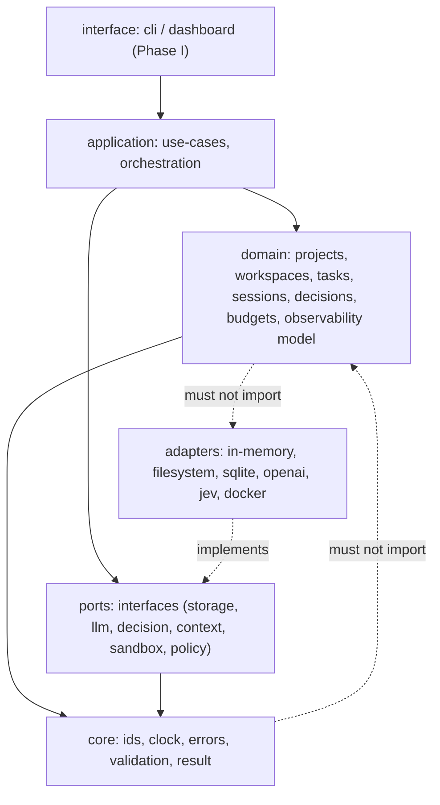

**MUST NOT**: `core/` and domain modules import an adapter, a vendor SDK, or a
network client. Vendors are only reachable through a port.

### 2.4 Layer placement test

When adding a capability, ask in order:

1. Can deterministic code decide it? → put it in `domain`/`application`, pure.
2. Does it need a bounded judgement call (routing, classification, selection, escalation)? → expose a port and route through the Decision Engine, with a deterministic fallback.
3. Does it need open-ended reasoning or generation? → route through the LLM Gateway.
4. Is it irreversible, high-risk, or ownership-bearing? → require a human approval record.

---

## 3. Core concepts

### 3.1 Hierarchy

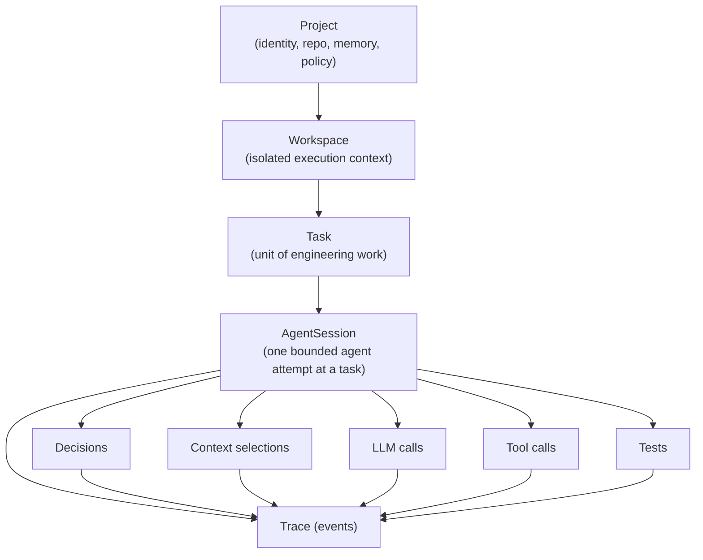

### 3.2 Glossary (normative terms)

| Term                                    | Definition                                                                                                                |
| --------------------------------------- | ------------------------------------------------------------------------------------------------------------------------- |
| **Project**                             | The top-level ownership boundary: an identity, a repository root, an engineering-memory namespace, a policy set.          |
| **Workspace**                           | An isolated execution context inside a project. All execution happens in a workspace, never in the project root directly. |
| **Task**                                | The first-class unit of engineering work with context, constraints, acceptance criteria, risk, budget, and status.        |
| **AgentSession**                        | One bounded attempt by an agent to advance a task. Owns counters, decisions, context, calls, and its event stream.        |
| **Decision**                            | A recorded answer to a bounded question, with the deciding layer, rationale, alternatives, and evidence.                  |
| **Decision Engine / Decision Provider** | The abstraction that answers bounded decision requests. JEV is one _implementation_ of it.                                |
| **Policy**                              | A declarative rule set mapping (operation, risk) → effect (`allow`/`verify`/`require-approval`/`deny`).                   |
| **Event**                               | An immutable, ordered fact emitted by the runtime; the atomic unit of observability and replay.                           |
| **Trace**                               | The ordered event stream for one task/session, sufficient to reconstruct what happened.                                   |
| **AIUsage**                             | Token accounting for one or more model calls (input/output/cached).                                                       |
| **Cost**                                | Money, stored as integer micro-USD.                                                                                       |
| **Budget**                              | Limits (tokens, cost, time, iterations, retries) plus the behaviour when a limit is approached or exceeded.               |
| **ContextBundle**                       | The selected, budgeted set of artifacts handed to a model call, with per-item provenance.                                 |
| **Engineering memory**                  | Project-scoped, human-reviewable knowledge (architecture, decisions, conventions, known issues, lessons).                 |
| **Checkpoint**                          | A durable snapshot that lets a task resume without replaying everything from the start.                                   |
| **Escalation**                          | Moving a decision up the ladder: code → policy → decision provider → LLM → human.                                         |

### 3.3 Identity and time (everywhere)

- All entities carry a **branded string id** (`ProjectId`, `WorkspaceId`, `TaskId`, `SessionId`, `DecisionId`, `EventId`).
- All timestamps are **ISO-8601 UTC strings** (`createdAt`, `updatedAt`, …). Never `Date` objects in persisted shapes.
- **Time is injected.** Domain logic never calls `Date.now()`; it receives a `Clock`. This is what makes replay and tests deterministic.

---

## 4. Project model

A **Project** is the ownership, isolation, and memory boundary.

```ts
export interface Project {
  readonly id: ProjectId;
  readonly name: string; // human label, e.g. "Payments API"
  readonly slug: string; // stable, url/filesystem safe, e.g. "payments-api"
  readonly rootPath: string; // absolute path to the project root
  readonly status: ProjectStatus; // "active" | "archived"
  readonly createdAt: string;
  readonly updatedAt: string;
}
```

**MUST**

- An id is immutable for the entity's lifetime.
- `slug` matches `^[a-z][a-z0-9-]*$` and is unique within a host installation.
- `rootPath` is absolute and does not contain a parent-traversal segment after resolution.
- All project-scoped state (memory, tasks, events, telemetry, secrets references, policy) lives under the project namespace. **No global mutable project state.**

**MUST NOT**

- Read or write another project's workspace, memory, events, or secrets by default.
- Store secrets inside the project record itself; the record holds _references_ (e.g. `secretRef: "env:PAYMENTS_DB_URL"`), never values.

`Deferred`: project type/toolchain detection ("typescript" | "python" | …), multi-project registry persistence.

### 4.1 Project lifecycle

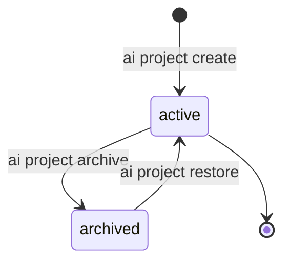

Archiving is **MUST NOT** destructive: archiving freezes new tasks but preserves all
events, memory, and traceability.

---

## 5. Workspace model

A **Workspace** is the isolated execution context in which tasks run. The whole of
§19 is expressed through the workspace's **IsolationProfile**.

```ts
export type IsolationMode =
  | "none" // no isolation (explicitly opted in; only for read-only local tooling)
  | "shared" // same OS process/filesystem as the host (in-process adapter)
  | "scoped" // host process, but path/env/network restricted by policy + adapter
  | "process" // separate OS process with restricted env and cwd
  | "container" // container runtime (Docker/Podman/other)
  | "sandbox" // OS-level sandbox (seatbelt/landlock/firejail/none)
  | "vm"; // full virtual machine

export type IsolationEnforcement = "enforced" | "declared" | "unsupported";

export interface IsolationDimension {
  readonly mode: IsolationMode;
  readonly enforcement: IsolationEnforcement;
  readonly note?: string;
}

export interface IsolationProfile {
  readonly filesystem: IsolationDimension;
  readonly git: IsolationDimension;
  readonly processes: IsolationDimension;
  readonly dependencies: IsolationDimension;
  readonly environment: IsolationDimension;
  readonly secrets: IsolationDimension;
  readonly network: IsolationDimension;
  readonly aiContext: IsolationDimension;
  readonly aiMemory: IsolationDimension;
  readonly taskHistory: IsolationDimension;
  readonly telemetry: IsolationDimension;
  readonly resourceLimits: IsolationDimension;
}

export interface Workspace {
  readonly id: WorkspaceId;
  readonly projectId: ProjectId;
  readonly name: string;
  readonly rootPath: string; // the workspace's own root (may be a worktree/subdir)
  readonly isolation: IsolationProfile;
  readonly status: WorkspaceStatus; // "provisioning" | "ready" | "paused" | "archived"
  readonly createdAt: string;
  readonly updatedAt: string;
}
```

### 5.1 Rules

**MUST**

- Every `Task` references an existing `Workspace`, and every `Workspace` references an existing `Project`. Orphans are invalid.
- The default profile is **isolated**, not permissive (§19.2).
- A dimension's `mode` is a _request_; `enforcement` records what the active adapter can actually deliver. Reporting must never claim enforcement it does not have.
- `enforcement: "unsupported"` on a high-consequence dimension (secrets, network, filesystem) **MUST** be surfaced to the user and **SHOULD** be treated as elevated risk.

**MUST NOT**

- Share a workspace `rootPath` between two projects.
- Allow a workspace to escape `project.rootPath` unless an explicit, recorded allowance exists.
- Assume containerization. `container` is one `IsolationMode`, not the architecture.

### 5.2 Why an abstraction instead of Docker

Requirement: _"design a Workspace abstraction that can later support containerized/sandboxed execution; do not prematurely lock to Docker."_

The `IsolationProfile` is a **capability description**, not a technology choice. The
`container` adapter (`Phase F`) implements the same profile; the domain never learns
which one ran. This keeps the core runnable on a laptop with `mode: "shared"` while
allowing CI to run `mode: "container"` with `enforcement: "enforced"`.

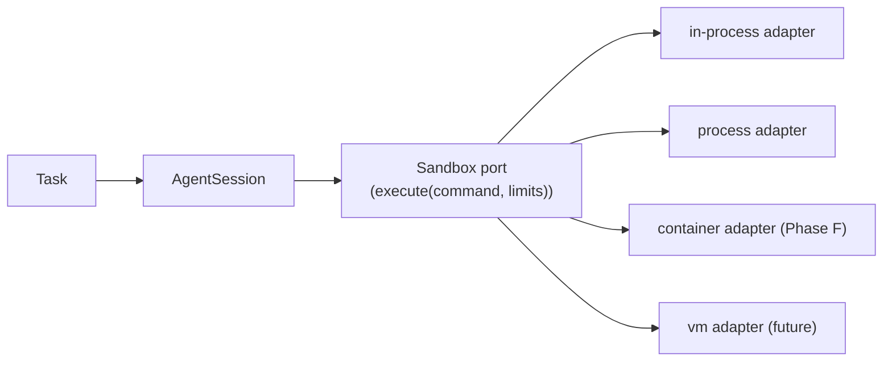

---

## 6. Task model

A **Task** is the central unit of engineering work and the anchor of all traceability.

```ts
export interface Task {
  readonly id: TaskId;
  readonly projectId: ProjectId;
  readonly workspaceId: WorkspaceId;
  readonly title: string;
  readonly description: string;
  readonly context: readonly string[]; // known state, relevant files, existing behaviour
  readonly constraints: readonly string[]; // must / must not / compatibility
  readonly acceptanceCriteria: readonly TaskAcceptanceCriterion[];
  readonly riskLevel: RiskLevel;
  readonly budget: Budget;
  readonly status: TaskStatus;
  readonly verificationStrategy: readonly VerificationStep[];
  readonly createdAt: string;
  readonly updatedAt: string;
  readonly completedAt?: string;
}

export interface TaskAcceptanceCriterion {
  readonly id: string; // stable within the task, e.g. "AC-1"
  readonly statement: string;
  readonly status: "pending" | "met" | "not-met" | "waived";
}

export interface VerificationStep {
  readonly level: 1 | 2 | 3 | 4 | 5; // docs/TASK_CONTRACT.md §9.1
  readonly command: string; // e.g. "pnpm test"
  readonly required: boolean;
}
```

**MUST**

- A task always has an id, project, workspace, title, status, risk level, and budget object (budget may be `{}` meaning "unbounded", but the field is present so that policy can reason about it).
- Because `{}` means unbounded, policy MAY require an explicit budget for `high`/`critical` risk tasks (ADR-009). An unbounded budget on a high-risk task is a policy finding, not a silent default.
- `completedAt` is set if and only if `status` is `completed`.
- Acceptance criteria are _observable_; a criterion with no verifiable statement is a defect in the task, not in the platform.
- Task status only changes through the lifecycle transition function (§18).

**SHOULD**

- The `Task` object stays small. Everything else (decisions, usage, calls, tests) is attached by `taskId` through events and records, not embedded in the task.

> **Design note.** Embedding usage/cost/calls inside `Task` would make the task a
> mutable god-object and break replay. The task is the _identity and contract_; the
> session and event log are the _execution record_.

`Deferred`: task templates, task labels/tags, subtasks/dependencies, cross-project task references.

---

## 7. Agent session model

An **AgentSession** is one bounded attempt to advance a task. A task may have many
sessions (retries, different agents, different models, human takeover); each session is
independently traced.

```ts
export type AgentSessionStatus = "active" | "completed" | "failed" | "aborted";

export interface AgentSession {
  readonly id: SessionId;
  readonly taskId: TaskId;
  readonly projectId: ProjectId;
  readonly workspaceId: WorkspaceId;
  readonly agentId: string; // logical agent identity, e.g. "codebuff"
  readonly providerIds: readonly string[]; // LLM providers used
  readonly modelIds: readonly string[]; // models used
  readonly status: AgentSessionStatus;
  readonly iteration: number;
  readonly llmCalls: number;
  readonly toolCalls: number;
  readonly startedAt: string;
  readonly endedAt?: string;
}
```

**MUST**

- Session counters (`iteration`, `llmCalls`, `toolCalls`) are a **projection** of the session's events and MUST be recomputable from them. They exist for cheap reads, never as the source of truth.
- A session belongs to exactly one task and cannot span workspaces.
- Ending a session sets `endedAt` and a terminal status; ended sessions are immutable except by appending events.

`Deferred`: multi-agent sessions, hand-off between agents mid-session, per-session cost roll-up persistence.

---

## 8. Decision engine

### 8.1 The ladder

The Decision Engine is the **routing and escalation layer for bounded decisions**. It is
not a component that answers everything; it is the _dispatcher_ that guarantees the
cheapest sufficient layer is used.

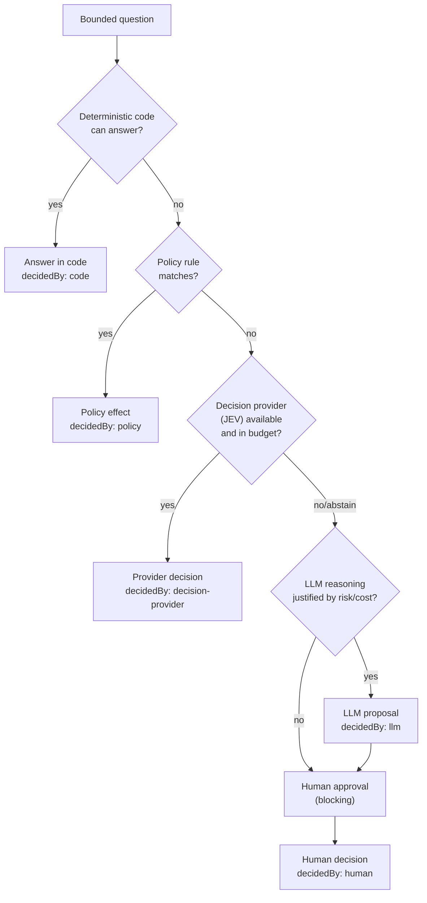

**MUST**

- Every step in the ladder is **optional**. A system configured with no decision provider, no LLM, and no human availability MUST still run — it collapses to deterministic code + policy, and _surfaces_ decisions it cannot make instead of guessing.
- Abstention is a first-class outcome. A provider that cannot decide says so; it never fabricates.
- Every decision that influenced an outcome is recorded (§8.3), including the layer that decided it.

### 8.2 Decision shape

```ts
export type DecisionKind =
  | "routing" // which provider/model/adapter to use
  | "classification" // categorize input, file, or change
  | "selection" // choose among candidate items (context, tools, files)
  | "policy" // choose which policy/rule applies
  | "escalation" // whether and where to escalate
  | "approval" // whether human approval is required
  | "other";

export type DecisionOutcome =
  | "pending" // asked, not yet answered
  | "selected"
  | "abstained"
  | "escalated"
  | "failed";
export type DecidedBy =
  "code" | "policy" | "decision-provider" | "llm" | "human";

export interface DecisionOption {
  readonly id: string;
  readonly label: string;
  readonly metadata?: Readonly<Record<string, string | number | boolean>>;
}

export interface Decision {
  readonly id: DecisionId;
  readonly projectId: ProjectId;
  readonly workspaceId: WorkspaceId;
  readonly taskId?: TaskId;
  readonly sessionId?: SessionId;
  readonly kind: DecisionKind;
  readonly question: string;
  readonly options: readonly DecisionOption[];
  readonly outcome: DecisionOutcome;
  readonly selectedOptionId?: string;
  readonly decidedBy?: DecidedBy; // absent while outcome === "pending"
  readonly rationale?: string;
  readonly confidence?: number; // 0..1, when the deciding layer can express it
  readonly alternativesConsidered: readonly string[];
  readonly evidence: readonly string[]; // references (event ids, file paths), never secret values
  readonly providerId?: string; // which decision provider, when decidedBy="decision-provider"
  readonly latencyMs?: number;
  readonly costMicros?: number;
  readonly createdAt: string;
  readonly decidedAt?: string;
}
```

**MUST**

- A `Decision` is created `pending` (no `decidedBy`, no `decidedAt`) when the question is asked, and is resolved **exactly once**. A resolved decision is immutable; re-resolving throws.
- A resolved decision (any outcome other than `pending`) MUST have `decidedBy` and `decidedAt`; a pending decision MUST NOT have either.
- `outcome === "selected"` requires a `selectedOptionId` that is one of `options`.
- Any other outcome MUST NOT carry a `selectedOptionId`.
- `decidedBy === "decision-provider"` requires `providerId`.
- `alternativesConsidered` is derived from the option set minus the selection, not hand-written.
- `evidence` holds **references**, not payloads. It must never contain secret material or full file contents.

### 8.3 Deterministic routing

Routing is itself a decision, and it is answered in code:

```ts
export interface DecisionProviderRegistration {
  readonly providerId: string;
  readonly kinds: readonly DecisionKind[];
  readonly priority: number; // lower wins
  readonly enabled: boolean;
}

export function selectDecisionProvider(
  registrations: readonly DecisionProviderRegistration[],
  kind: DecisionKind,
): DecisionProviderRegistration | undefined;
```

Selection is a pure, total, deterministic function: enabled registrations supporting the
kind, lowest priority, ties broken by `providerId` lexicographically. **No randomness, no
time, no I/O.** This is what makes "which engine decided this?" reproducible.

---

## 9. JEV integration strategy

### 9.1 Position of JEV

JEV is a **decision provider**, i.e. one implementation of `DecisionProvider` behind the
port defined in §24. It is _not_ the platform. Nothing in `domain/`, `tasks/`,
`workspaces/`, or `observability/` may import JEV, name JEV, or require it.

```ts
export interface DecisionCapabilities {
  readonly kinds: readonly DecisionKind[];
  readonly deterministic: boolean;
  readonly maxOptions?: number;
}

export interface DecisionRequest {
  readonly kind: DecisionKind;
  readonly question: string;
  readonly options: readonly DecisionOption[];
  readonly context: readonly string[]; // already-selected, redacted context
  readonly maxLatencyMs?: number;
  readonly maxCostMicros?: number;
  readonly correlationId: string; // project/workspace/task/session linkage
}

export type DecisionResponse =
  | {
      readonly outcome: "selected";
      readonly optionId: string;
      readonly rationale?: string;
      readonly confidence?: number;
    }
  | { readonly outcome: "abstained"; readonly reason: string }
  | {
      readonly outcome: "escalated";
      readonly reason: string;
      readonly to?: string;
    }
  | { readonly outcome: "failed"; readonly error: string };

export interface DecisionProvider {
  readonly id: string;
  readonly family: "jev" | "rules" | "heuristic" | "human" | "llm";
  capabilities(): DecisionCapabilities;
  decide(request: DecisionRequest): Promise<DecisionResponse>;
}
```

### 9.2 Rules

**MUST**

- JEV is consulted only for `routing`, `classification`, `selection`, `policy`, `escalation`, `approval` — **bounded** decisions with an enumerable option set.
- Option sets handed to JEV are **bounded** (SHOULD ≤ ~32) and fully enumerated. JEV never generates free-form output that becomes authoritative behaviour.
- If JEV is disabled, unavailable, over budget, or abstains, the ladder continues. **There is no code path where the absence of JEV stops the platform.**
- JEV calls are budgeted (`maxLatencyMs`, `maxCostMicros`) and counted as usage (§15) and as events (§17).
- Every JEV answer is recorded as a `Decision` with `decidedBy: "decision-provider"` and `providerId`.

**MUST NOT**

- Allow JEV to authorise a high-risk operation by itself. JEV may _propose_; `Policy` + human approval decide (§23).
- Let JEV output mutate architecture, memory, or policy without a human-visible record.
- Send secrets, credentials, or un-redacted file contents to JEV.

### 9.3 Degradation matrix

| Condition                   | Behaviour                                                                                                                                     |
| --------------------------- | --------------------------------------------------------------------------------------------------------------------------------------------- |
| No provider registered      | Ladder skips to the next available layer. Decision recorded as `abstained` at the provider layer is not required; the layer is simply absent. |
| Provider `abstained`        | Escalate to the next layer.                                                                                                                   |
| Provider `failed` / timeout | Emit `DecisionCompleted` with `outcome: "failed"`, retry per task budget, then escalate.                                                      |
| Budget exhausted            | Skip the provider, escalate; record the skip reason.                                                                                          |
| Policy says JEV unavailable | Deterministic fallback only.                                                                                                                  |

`Deferred (Phase D/F)`: a concrete JEV adapter, JEV prompt/taxonomy design, provider-side caching.

---

## 10. LLM gateway

### 10.1 Purpose

A single, provider-agnostic seam for model calls. Every call — regardless of vendor —
is normalised into the same request/response/usage shape so that §14–§16 work
uniformly.

```ts
export type LlmRole = "system" | "user" | "assistant" | "tool";

export interface LlmMessage {
  readonly role: LlmRole;
  readonly content: string;
}

export interface LlmRequest {
  readonly modelId: string;
  readonly messages: readonly LlmMessage[];
  readonly maxOutputTokens?: number;
  readonly temperature?: number;
  readonly stopSequences?: readonly string[];
  readonly correlationId: string; // for trace + usage attribution
}

export interface AIUsage {
  readonly inputTokens: number;
  readonly outputTokens: number;
  readonly cachedInputTokens: number; // subset of inputTokens
  readonly reasoningTokens?: number; // reported separately by some providers
}

export interface LlmResponse {
  readonly modelId: string;
  readonly providerId: string;
  readonly content: string;
  readonly finishReason:
    "stop" | "length" | "tool-call" | "content-filter" | "error";
  readonly usage: AIUsage;
  readonly latencyMs: number;
}

export interface LlmProvider {
  readonly id: string;
  readonly models: readonly string[];
  complete(request: LlmRequest): Promise<LlmResponse>;
  // streaming is an optional capability, not a core requirement
  stream?(request: LlmRequest): AsyncIterable<LlmChunk>;
}
```

### 10.2 Rules

**MUST**

- Provider selection is a `routing` decision (§8.3), not a hardcoded import.
- Usage is _always_ populated. If a provider does not report cached tokens, the adapter reports `0` — never `undefined`-as-unknown silently down the chain.
- Each call emits `LLMRequestStarted` / `LLMRequestCompleted` (§17) with model, provider, usage, latency, retries, and correlation id.
- The gateway applies the task budget _before_ dispatch (a call that would certainly exceed the budget is refused and escalated, not attempted).
- Prompts and completions are **not** stored by default. Storing them is an explicit, per-project opt-in with redaction, because prompts are the most likely place for secrets and PII to leak.

**MUST NOT**

- Import a vendor SDK anywhere outside `adapters/llm/*`.
- Expose provider-specific fields in core types (e.g. no `openaiMessages`).
- Treat a provider's token counts as trusted for billing without a local recomputation path (§14.4).

`Deferred (Phase D)`: concrete adapters, retry/backoff policy, prompt caching strategy, local token estimator.

---

## 11. Context engine

### 11.1 Purpose

> **Maximum useful context / minimum unnecessary tokens.**

The Context Engine decides _what enters the prompt_. It is the single largest lever on
token cost and the most likely place for accidental leakage, so it is deterministic,
budgeted, provenance-tracked, and independently testable without any LLM or JEV.

### 11.2 Model

```ts
export type ContextItemKind =
  | "file"
  | "symbol"
  | "dependency"
  | "git-history"
  | "previous-task"
  | "adr"
  | "convention"
  | "memory"
  | "test-result";

export interface ContextCandidate {
  readonly id: string;
  readonly kind: ContextItemKind;
  readonly ref: string; // path, symbol id, decision id — never the content itself
  readonly content: string; // already redacted
  readonly tokenCost: number;
  readonly relevance: number; // 0..1, produced by a ranker
  readonly authority: number; // 0..1, ADRs/conventions outrank raw files
  readonly recency: number; // 0..1, decayed by the injected Clock
  readonly redacted: boolean;
}

export interface ContextRequest {
  readonly taskId: TaskId;
  readonly sessionId: SessionId;
  readonly question: string;
  readonly maxTokens: number;
  readonly candidates: readonly ContextCandidate[];
  readonly requiredRefs?: readonly string[]; // always included if present
}

export interface ContextBundle {
  readonly items: readonly ContextCandidate[];
  readonly totalTokens: number;
  readonly droppedForBudget: readonly string[];
  readonly selectionRationale: string;
}

export interface ContextSelector {
  readonly id: string;
  select(request: ContextRequest): Promise<ContextBundle> | ContextBundle;
}
```

### 11.3 Selection algorithm (deterministic core)

The algorithm as built in Phase E is **additive and explainable** rather than a weighted
formula. Each observable signal contributes a fixed number of points and produces a
reason, so every selected candidate can answer "why was I included?" with arithmetic
instead of a verdict. See §36 for the exact signal table.

```
score(candidate) = sum(points(signal) for signal in candidate.signals)
                   + sum(points(rule) for rule in priorityRules matching candidate.ref)

order  = mandatory first, then score descending, then ref ascending, then kind ascending
select = greedy fill in that order while usedTokens + tokens <= budget
```

Selection then:

1. includes every explicitly referenced item that exists, regardless of score (these are
   the only **mandatory** candidates);
2. sorts the rest by `score` descending, tie-broken by `ref` then `kind` — a total order,
   so a selection never depends on filesystem enumeration order;
3. greedily includes items while `usedTokens + tokens <= budget`;
4. records every excluded item with the single reason it was dropped.

**MUST**

- The deterministic selector is the **default** and MUST be sufficient to run a task.
- A JEV/LLM-assisted selector MAY be layered on top (e.g. to produce `relevance` scores), but
  it MUST emit `ContextSelectionStarted` / `ContextSelected` events and MUST NOT bypass the
  token budget. The LLM gateway MUST NOT choose files, and the context engine MUST NOT call
  an LLM to choose context.
- Redaction happens **before** an item becomes a candidate. The context engine never sees raw
  secrets: a credential-shaped path is refused by name, before its bytes are read (§36.3).
- Items carry `ref` and reason **codes**, never raw content, in events. Event payloads record
  _what was selected and why_, not _what it said_.
- The budget is **never** exceeded, and a mandatory candidate that does not fit is reported as
  `budget-exceeded` — the run refuses to spend rather than proceeding without it.
- Nothing is truncated: a file is selected whole or not at all.

`Deferred (Phase F+)`: repository indexing, symbol graph, embedding ranker, git-blame recency,
engineering memory as a candidate source, a JEV-routed selector.

---

## 12. Policy engine

### 12.1 Purpose

The Policy Engine maps **(operation, risk)** → **effect**, deterministically. It is the
mechanism that makes "low risk → automatic, medium → verify, high → approval"
concrete, auditable, and testable.

```ts
export type RiskLevel = "low" | "medium" | "high" | "critical";

export type OperationKind =
  | "read"
  | "write"
  | "execute"
  | "delete"
  | "network"
  | "dependency-install"
  | "db-read"
  | "db-write"
  | "db-destructive"
  | "deploy"
  | "auth-change"
  | "secrets-read"
  | "secrets-write";

export type PolicyEffect = "allow" | "verify" | "require-approval" | "deny";

export interface PolicyRule {
  readonly id: string;
  readonly description: string;
  readonly operations: readonly OperationKind[];
  readonly minRisk: RiskLevel; // applies when effective risk >= minRisk
  readonly effect: PolicyEffect;
}

export interface Policy {
  readonly id: string;
  readonly name: string;
  readonly version: number;
  readonly rules: readonly PolicyRule[];
  readonly defaultEffect: PolicyEffect;
}

export interface PolicyRequest {
  readonly operation: OperationKind;
  readonly riskLevel: RiskLevel;
  readonly targets?: readonly string[];
}

export interface PolicyDecision {
  readonly effect: PolicyEffect;
  readonly matchedRuleId?: string;
  readonly reason: string;
  readonly requiresHumanApproval: boolean;
  readonly requiresVerification: boolean;
}
```

### 12.2 Evaluation rules

**MUST**

- Evaluation is a pure function `evaluatePolicy(policy, request) → PolicyDecision`.
- When several rules match, the **most restrictive effect wins**:
  `deny > require-approval > verify > allow`. Ties are broken by **specificity** (a rule matching fewer operations wins, because it explains the decision better than a broad safety net), then by rule `id` ascending. Fully deterministic.
- If no rule matches, `defaultEffect` applies. The default is `verify` — never `allow`.
- Effective risk is `max(declaredRisk, baselineRiskForOperation(operation))`, so an operation's inherent danger cannot be talked down by a low declared risk.

**Baseline risk floors (defaults, overridable by policy config):**

| Operation                                                            | Baseline risk |
| -------------------------------------------------------------------- | ------------- |
| `read`, `db-read`                                                    | `low`         |
| `write`, `execute`, `network`                                        | `medium`      |
| `dependency-install`, `secrets-read`, `db-write`                     | `high`        |
| `delete`, `db-destructive`, `deploy`, `auth-change`, `secrets-write` | `critical`    |

**MUST NOT**

- Let an LLM or JEV _weaken_ an effect. Proposed effects can only be escalated (`verify`→`require-approval`), never downgraded.
- Let policy evaluation perform I/O or depend on ambient state.

### 12.3 Policy sources and precedence

```
built-in defaults  <  project policy file  <  workspace policy override  <  task constraint
```

Higher-precedence levels may only make the effect **more** restrictive unless a change is
recorded as an ADR with explicit human approval (§22).

`Deferred (Phase F)`: policy file format + loader, policy packs, policy diffing, per-operation audit report.

---

## 13. Observability

### 13.1 Model

Observability has one source of truth: **the event log**. Everything else is a
projection.

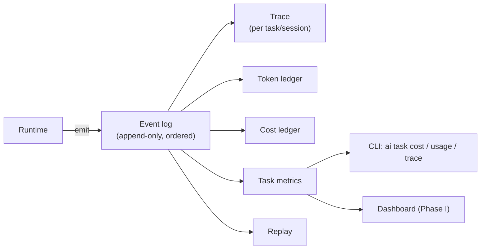

**MUST**

- Metrics are computed from events. **No human-entered metrics.** If a number cannot be derived from events, it does not go in the report.
- Events are append-only and ordered per stream (monotonic `sequence`).
- Every event is attributable: `projectId`, `workspaceId`, and where applicable `taskId`, `sessionId`, `correlationId`.
- Event payloads never contain secrets, credentials, tokens, or un-redacted prompt/context content (§20.3).
- Observability is **fail-open for the runtime, fail-closed for the ledger**: if an observability sink is unavailable, the task continues, but the report must state that accounting is incomplete rather than present partial numbers as complete.

### 13.2 What is tracked per task

| Metric                           | Source events                                          |
| -------------------------------- | ------------------------------------------------------ |
| input/output/cached/total tokens | `LLMRequestCompleted`                                  |
| model, provider                  | `LLMRequestCompleted`                                  |
| latency                          | `LLMRequestCompleted`, `ToolCallCompleted`             |
| estimated cost                   | `LLMRequestCompleted` × pricing table (§15)            |
| LLM calls                        | count of `LLMRequestCompleted`                         |
| tool calls                       | count of `ToolCallCompleted`                           |
| iterations                       | session loop turns: LLM requests that were not retries |
| retries                          | `LLMRequestCompleted.retry` count                      |
| escalations                      | `DecisionCompleted.outcome = "escalated"`              |
| JEV decisions                    | `DecisionCompleted.decidedBy = "decision-provider"`    |
| tests                            | `TestCompleted`                                        |
| human approvals                  | `HumanApprovalRequested`/`HumanApprovalGranted`        |
| duration                         | first → last event timestamp                           |

`Deferred (Phase C/D)`: durable event store, OpenTelemetry export adapter, dashboards, alerting.

---

## 14. Token accounting

### 14.1 Shape

```ts
export interface AIUsage {
  readonly inputTokens: number;
  readonly outputTokens: number;
  readonly cachedInputTokens: number; // SUBSET of inputTokens
  readonly reasoningTokens?: number; // subset of outputTokens when reported
}
```

### 14.2 Rules

**MUST**

- All counters are non-negative integers. Fractional or negative values are invalid input and MUST be rejected at the boundary.
- `totalTokens = inputTokens + outputTokens`. **Cached tokens are a subset of input tokens and MUST NOT be added again.**
- `addUsage(a, b)` is the only aggregation method, and it is associative and commutative — so per-call usage can be summed in any order and produce identical totals.
- Providers that omit a counter report `0`, which is distinguishable from `reasoningTokens: undefined` (provider did not report it at all).

### 14.3 Derivation chain

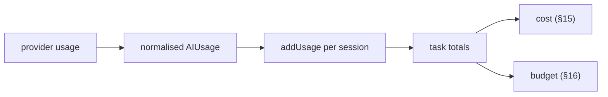

### 14.4 Why a local path must exist

Provider-reported token counts are **not authoritative** for anything except
estimation. V2 therefore keeps `AIUsage` as pure local data, so a local estimator
(SHOULD, `Phase D`) can be introduced later to cross-check provider numbers without
changing the domain. This is also what makes token accounting work for a provider that
reports nothing at all.

---

## 15. Cost accounting

### 15.1 Money representation

**MUST**: money is an **integer count of micro-USD** (`1 micro-USD = 1e-6 USD`).

Rationale: floating-point dollars accumulate visible error when summed over thousands
of calls; integer micros keep aggregation exact within `Number.MAX_SAFE_INTEGER`
(≈ $9.0 × 10⁹), and are trivially portable to a future `bigint`/`Decimal` adapter.

```ts
export interface Cost {
  readonly currency: "USD";
  readonly micros: number;
}

export interface ModelRate {
  readonly providerId: string;
  readonly modelId: string;
  readonly currency: "USD";
  readonly inputMicrosPerMillionTokens: number;
  readonly outputMicrosPerMillionTokens: number;
  readonly cachedInputMicrosPerMillionTokens: number;
  readonly effectiveFrom: string; // ISO date — rates change, history matters
}
```

### 15.2 Computation

```
billableInput   = inputTokens - cachedInputTokens
costMicros      = round(billableInput   * inputMicrosPerMillion / 1_000_000)
                + round(cachedInput     * cachedInputMicrosPerMillion / 1_000_000)
                + round(outputTokens    * outputMicrosPerMillion / 1_000_000)
```

**MUST**

- Pricing lives in a versioned `ModelRate` table, keyed by provider+model+`effectiveFrom`. Rates are _data_, not code.
- An unknown model produces a **priced-as-unknown** result: cost is reported as unavailable (`undefined`) rather than a fabricated `0`. Reporting a $0 cost for a real call is a correctness bug.
- Cost computed for a task is the sum of per-call costs, not a re-derivation from task totals — cached/billable splits differ per call and per model.
- `estimated` is explicit: every cost value in V2 is an estimate derived from a rates table, never an invoice.

`Deferred (Phase D)`: rate table source/update strategy, per-provider discount tiers, subscription-vs-API mode, currency conversion.

---

## 16. AI budgets

### 16.1 Shape

```ts
export interface Budget {
  readonly maxTokens?: number;
  readonly maxCostMicros?: number;
  readonly maxDurationMs?: number;
  readonly maxIterations?: number;
  readonly maxRetries?: number;
  readonly onExceeded?: "stop" | "require-approval";
}

export interface BudgetThresholds {
  readonly warning: number; // default 0.8
  readonly critical: number; // default 0.9
}

export type BudgetLevel = "ok" | "warning" | "critical" | "exceeded";
export type BudgetAction =
  "warn" | "optimize" | "escalate" | "stop" | "require-approval";
```

### 16.2 Semantics

```
level = max over dimensions of:
  consumed/limit >= 1    -> "exceeded"
  consumed/limit >= 0.9  -> "critical"
  consumed/limit >= 0.8  -> "warning"
  otherwise              -> "ok"
```

| Level      | Default actions                                                      |
| ---------- | -------------------------------------------------------------------- |
| `ok`       | none                                                                 |
| `warning`  | `warn`                                                               |
| `critical` | `optimize`, `escalate`                                               |
| `exceeded` | `stop`, or `require-approval` if `onExceeded === "require-approval"` |

**MUST**

- Evaluation is a pure function of `(budget, consumption, thresholds)`. No provider, no clock, no I/O.
- An absent limit is **unbounded** and never contributes a level. A limit of `0` is valid and means "no consumption permitted".
- Exceeding a hard limit MUST NOT silently continue. It either stops the session or requires explicit approval — and either way it emits an event.
- Budget logic MUST NOT live inside an LLM adapter; the adapter reports usage, the budget layer decides.
- Budget checks happen **before** an expensive action (pre-flight) and **after** it (reconciliation), because token counts are only known after a call returns.

### 16.3 Budget flow

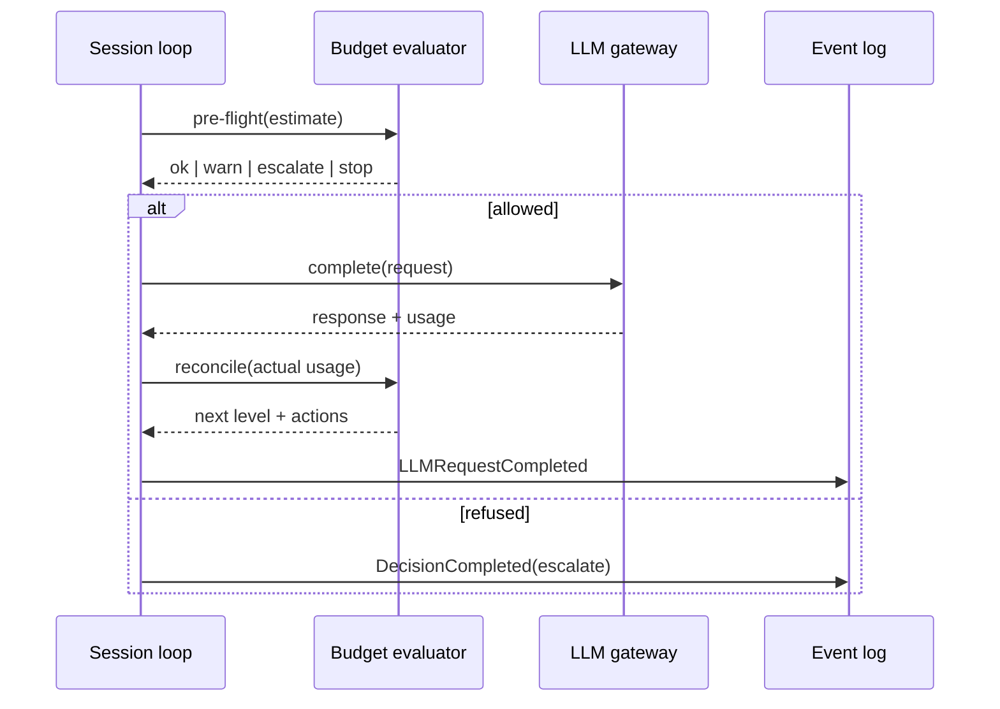

---

## 17. Event model

### 17.1 Envelope

```ts
export type EventType =
  | "TaskCreated"
  | "TaskStarted"
  | "TaskCompleted"
  | "TaskFailed"
  | "ContextSelected"
  | "DecisionRequested"
  | "DecisionCompleted"
  | "LLMRequestStarted"
  | "LLMRequestCompleted"
  | "ToolCallStarted"
  | "ToolCallCompleted"
  | "TestStarted"
  | "TestCompleted"
  | "CheckpointCreated"
  | "HumanApprovalRequested"
  | "HumanApprovalGranted";

export type ActorType =
  "human" | "agent" | "code" | "decision-provider" | "llm" | "system";

export interface EventActor {
  readonly type: ActorType;
  readonly id: string;
}

export interface EventEnvelope<
  K extends EventType = EventType,
  P = EventPayloadMap[K],
> {
  readonly schemaVersion: 1;
  readonly id: EventId;
  readonly type: K;
  readonly occurredAt: string;
  readonly sequence: number; // monotonic per stream
  readonly actor: EventActor;
  readonly projectId: ProjectId;
  readonly workspaceId: WorkspaceId;
  readonly taskId?: TaskId;
  readonly sessionId?: SessionId;
  readonly correlationId?: string;
  readonly payload: P;
}
```

### 17.2 Payload requirements per event

| Event                                             | Required payload                                                                                                                                                                                                                                                                                                                                                                            |
| ------------------------------------------------- | ------------------------------------------------------------------------------------------------------------------------------------------------------------------------------------------------------------------------------------------------------------------------------------------------------------------------------------------------------------------------------------------- |
| `TaskCreated` / `TaskStarted`                     | `title`, `riskLevel`, `workspaceId`                                                                                                                                                                                                                                                                                                                                                         |
| `TaskCompleted` / `TaskFailed`                    | `reason?`, `acceptanceCriteriaMet`, `acceptanceCriteriaTotal`                                                                                                                                                                                                                                                                                                                               |
| `ContextSelectionStarted`                         | `selectionId`, `strategy`, `selectionVersion`, `budgetTokens`, `configFingerprint`                                                                                                                                                                                                                                                                                                          |
| `ContextSelected`                                 | `selectionId`, `strategy`, `selectionVersion`, `configFingerprint`, `budgetTokens`, `candidateTokens`, `selectedTokens`, `excludedTokens`, `remainingTokens`, `mandatoryTokens`, `considered`, `filteredByScore`, `excludedByRules`, `budgetExceeded`, `overBudgetTokens`, `durationMs`, `capabilities[]`, `unavailableCapabilities[]`, `selectedRefs[]`, `excludedRefs[]`, `refsTruncated` |
| `DecisionRequested`                               | `kind`, `question`, `optionCount`                                                                                                                                                                                                                                                                                                                                                           |
| `DecisionCompleted`                               | `decisionId`, `kind`, `outcome`, `decidedBy`, `selectedOptionId?`, `latencyMs?`                                                                                                                                                                                                                                                                                                             |
| `LLMRequestStarted`                               | `providerId`, `modelId`, `messageCount`, `contextSelectionId?`, `contextSelectionVersion?`, `contextSelectedTokens?`                                                                                                                                                                                                                                                                        |
| `LLMRequestCompleted`                             | `providerId`, `modelId`, `usage`, `latencyMs`, `retry`, `escalated`                                                                                                                                                                                                                                                                                                                         |
| `ToolCallStarted` / `ToolCallCompleted`           | `toolId`, `operation?`, `ok?`, `latencyMs?`                                                                                                                                                                                                                                                                                                                                                 |
| `TestStarted` / `TestCompleted`                   | `suite`, `passed?`, `failed?`, `durationMs?`                                                                                                                                                                                                                                                                                                                                                |
| `CheckpointCreated`                               | `checkpointId`, `reason`, `eventSequence`                                                                                                                                                                                                                                                                                                                                                   |
| `HumanApprovalRequested` / `HumanApprovalGranted` | `requestId`, `operation?`, `riskLevel`, `approver?`                                                                                                                                                                                                                                                                                                                                         |

**MUST**

- Payloads contain **metadata and references**, not secrets and not raw prompts.
- **Traceability completeness (added by the Phase 1.5 validation pass).** An event emitted while a task is in scope MUST carry `taskId`, and MUST carry `sessionId` when a session is active. `Task → Session → Event` may not depend on optional correlation: `taskId`/`sessionId` are optional in the _type_ only because some events are genuinely project-scoped (e.g. `ai doctor`, project/workspace lifecycle). Every task-scoped emitter MUST populate them, and an invariant test SHOULD assert it.
- `schemaVersion` is present on every event from day one; the store must be able to hold mixed versions and replay must dispatch on it.
- `sequence` is per-stream monotonic. Replay orders by `(stream, sequence)`, never by wall-clock alone (clock skew is real).
- Event constructors validate their payload. A malformed event MUST fail at construction, not at read time.

`Deferred (Phase C)`: durable event store, JSONL/NDJSON export, schema migration tooling, event compaction.

---

## 18. Task lifecycle

### 18.1 States

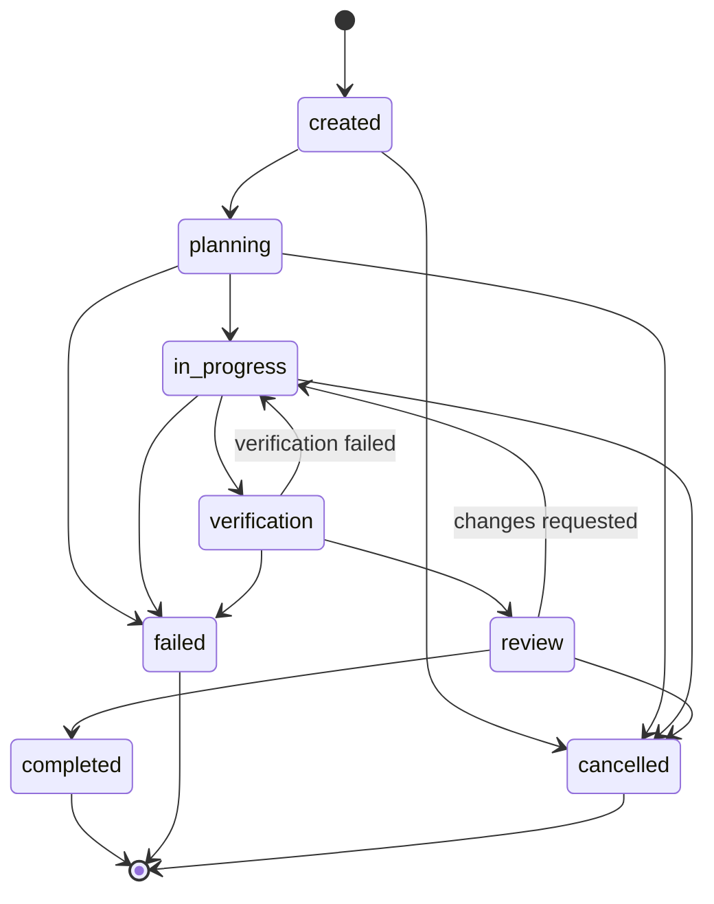

Terminal states: `completed`, `failed`, `cancelled`.

### 18.2 Transition rules

**MUST**

- Transitions are a **pure function** over a declared transition table. Any transition not in the table throws a typed `DomainError` with code `TRANSITION`.
- Terminal states cannot transition. Terminal states are immutable except for appended events.
- Entering `completed` sets `completedAt`; no other state may set it.
- `review → in_progress` and `verification → in_progress` are the only backwards transitions, and they exist because honest verification fails and rework is normal.
- Every transition emits a `Task*` event. The lifecycle's source of truth is the event log; `Task.status` is a projection.

### 18.3 Lifecycle vs human control

| Transition               | Gate                                                          |
| ------------------------ | ------------------------------------------------------------- |
| `created → planning`     | none (low risk)                                               |
| `planning → in_progress` | budget must be present and policy must not `deny`             |
| `verification → review`  | required verification steps must have run                     |
| `review → completed`     | `high`/`critical` risk tasks require a `HumanApprovalGranted` |

---

## 19. Workspace isolation

### 19.1 Principle

> **Isolation by default, access by explicit permission.**

Isolation is a property of the **Workspace** and is described by the 12 dimensions of
§5. Isolation is _declared_ (what the workspace requests) and _enforced_ (what the active
adapter delivers); the difference is always visible.

### 19.2 Default profile

| Dimension      | Default mode | Default enforcement | Intent                                                           |
| -------------- | ------------ | ------------------- | ---------------------------------------------------------------- |
| filesystem     | `scoped`     | `declared`          | Reads/writes confined to the workspace root                      |
| git            | `scoped`     | `declared`          | Own repository/worktree; no writes to the project primary remote |
| processes      | `process`    | `declared`          | Child processes only, no host-wide control                       |
| dependencies   | `scoped`     | `declared`          | Workspace-local install tree                                     |
| environment    | `scoped`     | `declared`          | Explicit allow-list; no ambient host env                         |
| secrets        | `scoped`     | `declared`          | Per-project references; nothing shared                           |
| network        | `none`       | `declared`          | Denied unless explicitly granted                                 |
| aiContext      | `scoped`     | `declared`          | Context drawn only from this project/workspace                   |
| aiMemory       | `scoped`     | `declared`          | Memory namespace = project + workspace                           |
| taskHistory    | `scoped`     | `declared`          | Task/event history scoped to the workspace                       |
| telemetry      | `scoped`     | `declared`          | Attribution always carries project/workspace id                  |
| resourceLimits | `scoped`     | `declared`          | CPU/memory/time ceilings requested per run                       |

`enforcement: "declared"` means: _the workspace asserts these boundaries and the
adapters must honour them; the current adapter does not independently prove it._
Honest reporting beats optimistic reporting — this field is what prevents the platform
from claiming a sandbox it does not have.

### 19.3 Access model

Cross-boundary access is expressed as an explicit, recorded grant:

```ts
export interface AccessGrant {
  readonly id: string;
  readonly dimension: keyof IsolationProfile;
  readonly fromWorkspaceId: WorkspaceId;
  readonly toRef: string; // path, secret ref, host, dataset
  readonly reason: string;
  readonly grantedBy: "human"; // grants are human-owned, never AI-owned
  readonly grantedAt: string;
  readonly expiresAt?: string;
}
```

**MUST**

- No implicit cross-project access, ever.
- Grants are human-issued; an agent MAY request, never grant.
- Grants are recorded in the event log (`HumanApprovalGranted`) and expire when `expiresAt` passes.
- `secrets` grants are per-reference, never "*".

`Deferred (Phase F)`: grant persistence, enforcement adapters, container/process sandbox implementation, resource-limit enforcement.

---

## 20. Security model

### 20.1 Principles

Least privilege · explicit permissions · workspace isolation · secret isolation ·
safe command execution · auditability · no implicit cross-project access · no global
mutable project state · no secret logging · no accidental context leakage.

### 20.2 Threat model (abbreviated)

| Threat                                       | Control                                                                                      |
| -------------------------------------------- | -------------------------------------------------------------------------------------------- |
| Prompt injection from repo/retrieved content | `AGENTS.md` §3 trust model; untrusted content can never grant permission                     |
| Over-broad file access                       | Workspace `filesystem` isolation + access grants                                             |
| Destructive operation from an agent          | Policy engine risk floors + human approval for `high`/`critical`                             |
| Secret exfiltration via context              | Redaction before candidacy; secrets never become `ContextCandidate`s                         |
| Secret leakage into logs/events/telemetry    | Payload allow-list; secret-shaped value detection; references not values                     |
| Cross-project data bleed                     | Per-project namespaces for memory, events, telemetry, secrets, context                       |
| Supply-chain compromise                      | Dependency discipline (`AGENTS.md` §9), lockfile + frozen installs, auditability of installs |
| Cost/DoS by unbounded agent loops            | Budgets (§16) with iteration/token/cost ceilings                                             |
| Unreproducible/silent behaviour change       | Event log + replay (§30) + ADRs (§22)                                                        |

### 20.3 Rules

**MUST**

- Secrets are referenced, never embedded: `env:VAR`, `file:/abs/path#key`, `vault:path`.
- A central redaction step runs on any text before it can become context, an event payload, a log line, or a provider request.
- Command execution goes through the sandbox port with an operation descriptor; the policy engine evaluates the _descriptor_, not a free-form string.
- Trust boundary crossings (CLI args, files, network, provider responses, plugin manifests) are schema-validated.
- Audit: every approval, grant, deny, and destructive operation is an event.

**MUST NOT**

- Log, print, or persist secret values, auth headers, or private keys.
- Disable a security control to make something pass.
- Let a task's failure to run policy evaluation default to `allow`.
- Retain raw prompts/responses by default.

---

## 21. Engineering memory

### 21.1 Layout

```
.ai/
├── memory/
│   ├── architecture/
│   ├── decisions/        # ADRs (also mirrored to docs/adr/ for human review)
│   ├── conventions/
│   ├── known-issues/
│   └── lessons/
├── agents/
├── policies/
├── prompts/
├── workflows/
└── project.yaml
```

### 21.2 Rules

**MUST**

- Memory is **project- and workspace-scoped**. There is no global memory. Sharing memory across projects is an explicit export/import operation with human review.
- Every memory entry has: id, kind, scope (`project` | `workspace`), created/updated timestamps, `sourceTaskId` (or `human`), and a `reviewStatus`.
- Memory created by AI starts as `proposed`. Memory becomes `authoritative` only after explicit human acceptance (§22). **AI-generated knowledge must never silently become authoritative.**
- Memory is **content-addressed and diffable** so replay can reconstruct which memory version participated in a task.
- Memory is redacted using the same rules as context (§20.3).

### 21.3 Entry shape

```ts
export interface MemoryEntry {
  readonly id: string;
  readonly kind:
    "architecture" | "decision" | "convention" | "known-issue" | "lesson";
  readonly scope: "project" | "workspace";
  readonly projectId: ProjectId;
  readonly workspaceId?: WorkspaceId;
  readonly title: string;
  readonly body: string;
  readonly sourceTaskId?: TaskId;
  readonly proposedBy: "human" | "agent" | "decision-provider";
  readonly reviewStatus: "proposed" | "accepted" | "rejected" | "superseded";
  readonly supersedes?: string;
  readonly createdAt: string;
  readonly updatedAt: string;
}
```

`Deferred (Phase G)`: memory loader/writer, retrieval integration with the context engine, deduplication, memory-garbage collection.

---

## 22. ADR integration

Architecture decisions are **human-owned** and traceable.

```ts
export interface ArchitectureDecisionRecord {
  readonly id: string; // "ADR-0007"
  readonly title: string;
  readonly status: "proposed" | "accepted" | "deprecated" | "superseded";
  readonly context: string;
  readonly decision: string;
  readonly consequences: string;
  readonly alternatives: readonly string[];
  readonly decidedBy: "human"; // MUST be human — see rules
  readonly recordedBy: "human" | "agent";
  readonly taskId?: TaskId;
  readonly sessionId?: SessionId;
  readonly decisionIds?: readonly DecisionId[]; // JEV / engine decisions that informed it
  readonly contextRefs?: readonly string[]; // ContextBundle refs that informed it
  readonly supersedes?: string;
  readonly createdAt: string;
  readonly acceptedAt?: string;
}
```

**MUST**

- `decidedBy` is always `human`. AI may draft (`recordedBy: "agent"`), but acceptance requires an explicit human action that produces a `HumanApprovalGranted` event.
- An ADR can reference the task, session, decision-engine decisions, and context that produced it — this is the traceability requirement.
- Only `accepted` ADRs may be treated as authoritative convention by the context engine.
- Superseding an ADR is additive: the old ADR stays, with `status: "superseded"`, so history is never rewritten.
- AI `proposed` ADRs MUST be visibly distinguishable from human-`accepted` ones in any list, report, or context bundle.

See `docs/architecture/DECISIONS.md` for the ADR-style record of V2's own initial decisions.

`Deferred (Phase G)`: ADR file format under `docs/adr/`, generation from memory entries, linking tooling.

---

## 23. Human approval model

### 23.1 Risk-aware execution

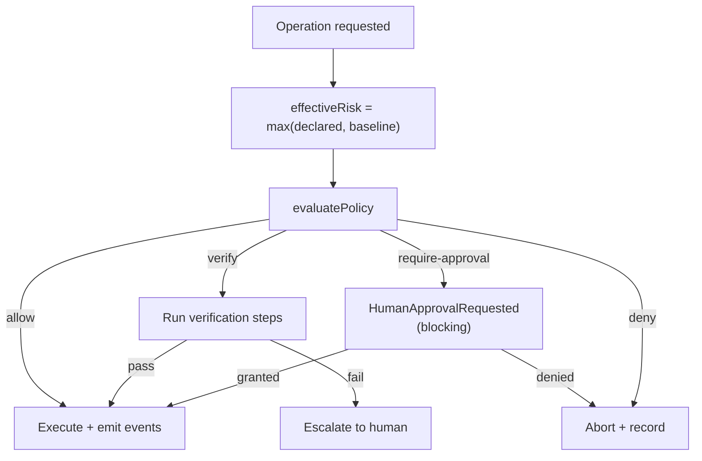

| Risk       | Default behaviour                                |
| ---------- | ------------------------------------------------ |
| `low`      | automatic execution                              |
| `medium`   | execute with verification                        |
| `high`     | explicit human approval required                 |
| `critical` | explicit human approval + policy must not `deny` |

### 23.2 Approval record

```ts
export interface ApprovalRequest {
  readonly id: string;
  readonly projectId: ProjectId;
  readonly workspaceId: WorkspaceId;
  readonly taskId?: TaskId;
  readonly sessionId?: SessionId;
  readonly operation: OperationKind;
  readonly riskLevel: RiskLevel;
  readonly summary: string;
  readonly requestedAt: string;
  readonly status: "pending" | "granted" | "denied" | "expired";
  readonly approver?: string;
  readonly decidedAt?: string;
  readonly expiresAt?: string;
}
```

**MUST**

- Approvals are blocking by default. Timeouts result in `expired` → the safe path (abort), never implicit consent.
- An approval is scoped to a specific operation + target + session. Approvals are **not** transferable and **not** remembered as blanket consent.
- Denials and expiries are recorded with the same rigour as grants.
- Approvals never contain secret values in `summary` — only references and intent.
- Human approval is required for: destructive database operations, production changes, authentication/security changes, destructive filesystem operations, sensitive configuration changes.

`Deferred (Phase F)`: CLI approval UX, approval queue persistence, multi-approver workflows, notification channels.

---

## 24. Provider abstraction

### 24.1 Ports

| Port               | Responsibility                        | Adapters planned                          |
| ------------------ | ------------------------------------- | ----------------------------------------- |
| `Clock`            | `now(): Date`                         | system, fixed (tests/replay)              |
| `DecisionProvider` | Bounded decisions                     | JEV, deterministic rules, human, LLM      |
| `LlmProvider`      | Model completion + usage              | OpenAI-compatible, Anthropic, local       |
| `ContextSelector`  | Context selection                     | deterministic (default), JEV/LLM-assisted |
| `Sandbox`          | Command/process execution with limits | in-process, process, container, vm        |
| `EventStore`       | Append/read ordered events            | in-memory, JSONL, SQLite, Postgres        |
| `TaskRepository`   | Task persistence                      | in-memory, file, SQLite, Postgres         |
| `MemoryStore`      | Engineering memory                    | filesystem, SQLite                        |
| `MetricsProjector` | Events → metrics                      | in-memory, materialised views             |
| `CheckpointStore`  | Checkpoints                           | filesystem, object store                  |
| `Logger`           | Structured logging with redaction     | console (JSON), file, OTLP                |

### 24.2 Rules

**MUST**

- A port is a TypeScript `interface` with no vendor types in its signature.
- Every port has a **deterministic or in-memory default** so the platform runs offline with zero external services. Stability over integration: the core must never require network access.
- Adapters are constructed only at composition roots (CLI entry, tests, future server). Domain code receives them via constructor/parameter injection.
- Interfaces are small and focused. A port with more than ~5 methods is a smell that it conflates responsibilities.

**MUST NOT**

- Leak vendor identifiers into port signatures (`openai`, `docker`, `postgres` never appear in `core/` or domain types).
- Build for multiple implementations of a port speculatively. Introduce the port when a second implementation is _imminent_, not imagined.

---

## 25. CLI architecture

### 25.1 Command surface

```text
ai init                              # scaffold .ai/ + project.yaml
ai doctor                            # environment + config + isolation diagnostics

ai project create <slug>             # register a project
ai project list
ai project show <slug>

ai workspace create <name>           # create an isolated workspace
ai workspace status [<name>]

ai task create                       # define a task (context/constraints/criteria/risk/budget)
ai task run <taskId>                 # execute via session(s)
ai task status [<taskId>]
ai task trace <taskId>               # ordered event timeline
ai task cost <taskId>                # cost breakdown by call/model
ai task usage <taskId>               # token + call + iteration metrics
ai task budget <taskId>              # budget consumption vs limits

ai decisions [<taskId>]              # decision log, filterable by decidedBy
ai memory <list|show|propose|accept>
ai adr <list|show|new|accept>
ai policy <show|explain <operation>>
```

### 25.2 Rules

**MUST**

- The CLI is a **thin adapter**: parse/validate args → call an application use-case → format output. No business logic in command handlers.
- **Zero mandatory runtime dependencies** for the core. A dependency-light arg parser (or Node's built-in `util.parseArgs`) SHOULD be used; no CLI framework unless it earns its place.
- Every command supports `--json` for machine consumption; human output is for humans and is not a stable contract.
- Every command that can mutate state supports `--dry-run`.
- `ai doctor` is the first-line diagnostic: it reports toolchain versions, resolved config, isolation enforcement level per dimension, and which optional adapters (JEV, LLM, sandbox, store) are active — including explicitly reporting "not configured".
- Exit codes are stable and documented: `0` success, `1` general failure, `2` usage error, `3` policy denied, `4` budget exceeded, `5` approval required/denied.

`Deferred (Phase C)`: the entire CLI. §25.1 is a target surface, not an implementation claim.

---

## 26. Future dashboard architecture (deferred)

**This is explicitly out of scope for the current phase.** The core must be fully usable
without a web UI; no backend is required by the domain.

Design constraints recorded now so the core does not accidentally block it:

- The dashboard is a **read-mostly projection over the event log**. It owns no business logic and no source of truth.
- It consumes a stable, versioned **JSON projection** (`TaskMetrics`, traces, decisions, usage) — the same data the CLI's `--json` mode emits.
- It must be **optional and removable**: removing the dashboard must not require touching `core/`, domain, or adapters.
- It must not require a server for the CLI to work; it may read a local store directly or through an optional read-only service.

Planned panels: active tasks · task timeline · token usage · cost · LLM calls · JEV decisions ·
tool calls · latency · test results · AI iterations · human approvals · workspace status.

---

## 27. Storage abstraction

### 27.1 Approach

Storage is behind the ports of §24. Phase 2 ships **no database**: the domain is pure, and
in-memory implementations live with tests.

**MUST**

- Persistence shapes are separate from domain shapes, with explicit mappers. A schema change must not force a domain rewrite, and a domain refactor must not corrupt stored data.
- Every persisted record carries `schemaVersion` so migrations are possible without downtime-style guesswork.
- Events are append-only. Corrections are new events, never mutations.
- A `TaskRepository` write is **last-write-wins on versioned records**: each write carries the version it read, and a mismatch is a conflict error. (Optimistic concurrency, so two sessions can't silently clobber a task.)
- Local-first default: filesystem/JSONL and SQLite before any server database.

### 27.2 Storage decision (see `DECISIONS.md` ADR-012)

- **Phase 2 (now):** no persistence. Pure domain + in-memory iteration.
- **Phase C:** append-only JSONL event log + file-backed task records. Zero runtime dependencies, human-inspectable, grep-able, git-diffable.
- **Later, if and only if needed:** a `StorageAdapter` port with SQLite/Postgres adapters, chosen by measurement (query volume, concurrency), not by preference.

`Deferred`: all of the above beyond Phase 2.

---

## 28. Testing strategy

### 28.1 Layers (maps to `docs/TASK_CONTRACT.md` §9.1)

| Level | Scope                   | Tooling                                                                   | Required for        |
| ----- | ----------------------- | ------------------------------------------------------------------------- | ------------------- |
| 1     | Static                  | Prettier, ESLint, `tsc --noEmit`                                          | everything          |
| 2     | Unit (pure domain)      | Vitest — deterministic, offline                                           | all domain logic    |
| 3     | Integration             | Vitest + in-memory adapters (fake clock, fake providers, in-memory store) | ports + composition |
| 4     | Runtime                 | `node dist/index.js`, CLI smoke commands                                  | CLI/artifacts       |
| 5     | End-to-end / evaluation | Golden task suite (§29)                                                   | phase gates         |

### 28.2 Rules

**MUST**

- Domain tests are **deterministic and offline**: no network, no real clock, no real filesystem writes, no randomness. Time and ids are injected.
- Tests assert **behaviour and invariants**, not implementation details: lifecycle legality, budget arithmetic, usage/cost summation, isolation defaults, policy precedence, event shape.
- Every port gets a deterministic fake. `FakeClock`, `AbstainingDecisionProvider`, and in-memory stores are first-class test infrastructure.
- Property-style checks are preferred where arithmetic is involved: `addUsage` associativity/commutativity, monotonic `sequence`, cost summation independence of order.
- A test that cannot fail is not a test. Coverage numbers are not a goal (`AGENTS.md`: no meaningless tests for coverage).
- Regression tests accompany every bug fix.

**MUST NOT**

- Mock the domain. Only I/O boundaries are faked.
- Let tests depend on the machine, the timezone, or the current date.

---

## 29. Evaluation strategy

Where unit tests prove _correctness of the platform_, evaluation proves _quality of the AI
engineering workflow_.

### 29.1 What is evaluated

| Dimension         | Metric                                                                   |
| ----------------- | ------------------------------------------------------------------------ |
| Task success      | acceptance criteria met / total, verified by deterministic checks        |
| Cost efficiency   | cost micros per accepted task; cost per acceptance criterion             |
| Token efficiency  | tokens per accepted task; context tokens vs total tokens (context ratio) |
| Speed             | wall-clock per task; time to first verified build                        |
| Reliability       | retries, escalations, human interventions per task                       |
| Decision quality  | JEV decisions later overridden by humans (override rate)                 |
| Regression safety | existing tests passing after AI change                                   |

### 29.2 Structure

```
evals/
├── tasks/           # golden Task definitions (small, deterministic, offline)
├── fixtures/        # repos/fixtures the tasks run against
├── runners/         # harness: run N tasks, collect events, project metrics
└── reports/         # generated metric summaries (not committed as source of truth)
```

**MUST**

- Evaluation tasks are **tasks** — they use the same `Task` model, budgets, policy, and events as real work. No parallel evaluation-only abstractions.
- Evaluations are **reproducible**: same task + same seed + same model ⇒ comparable measurements; providers are recorded with model ids.
- Evaluation asserts _outcomes_ (tests pass, criteria met), not prompt text.
- Reports are generated from events (§13), never hand-written.

`Deferred (Phase D/E)`: `evals/` harness implementation, goldens, threshold enforcement in CI.

---

## 30. Replay and checkpoint strategy

### 30.1 Why

Reproducibility is a stated V2 goal. Replay answers: _"What exactly happened, and can
we re-run the decision path?"_

### 30.2 Two modes

| Mode                | Input                   | Guarantee                                                                                                                                                 |
| ------------------- | ----------------------- | --------------------------------------------------------------------------------------------------------------------------------------------------------- |
| **Trace replay**    | event log               | Deterministic _reconstruction_ of the timeline and metrics — exact                                                                                        |
| **Decision replay** | event log + checkpoints | Re-runs decision points; deterministic layers reproduce exactly, non-deterministic layers (LLM/JEV) are re-asked and may differ, and the diff is reported |

**MUST**

- Trace replay is always available and always exact. It requires no providers, no network, and no model.
- Decision replay **never** presents a re-run of a non-deterministic layer as "what happened". The original decision stays authoritative; replay output is explicitly an _alternative_, with differences reported.
- Determinism boundaries are explicit per layer: `code` and `policy` are deterministic; `decision-provider` and `llm` are not. This classification is part of the design, not an afterthought.
- Events are the replay input, so any behaviour worth replaying MUST emit events.

### 30.3 Checkpoints

**MUST**

- A checkpoint records a durable point in time: task id, session id, event `sequence`, workspace state reference, and a reason (`budget-critical`, `approval-requested`, `iteration-limit`, `manual`, `before-destructive-op`).
- Checkpoints are written **before** risky operations (so a crash is recoverable) and on budget thresholds.
- Replay/resume starts from the checkpoint's `sequence`; events before it are folded into a summary rather than replayed.
- The checkpoint sequence is monotonic per session; gaps/duplicates are detectable and reported.

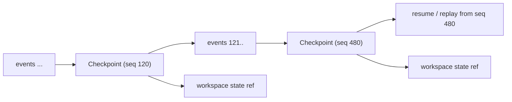

`Deferred (Phase H)`: checkpoint store, rehydrator, replay CLI (`ai task replay --from <checkpoint>`), diff reporting.

---

## 31. Plugin architecture

### 31.1 Goal

Third parties (and future projects) extend the platform **without forking core**:
decision providers, LLM adapters, context selectors, policy packs, storage adapters,
sandbox adapters, CLI commands, metric projectors.

### 31.2 Manifest

```ts
export interface PluginManifest {
  readonly schemaVersion: 1;
  readonly id: string; // "acme.jev-adapter"
  readonly name: string;
  readonly version: string;
  readonly apiVersion: string; // compatible platform API version
  readonly entry: string; // module path
  readonly capabilities: readonly PluginCapability[];
  readonly permissions: readonly PluginPermission[]; // declared, human-approved
  readonly isolation: "in-process" | "process" | "container";
}

export type PluginCapability =
  | "decision-provider"
  | "llm-provider"
  | "context-selector"
  | "policy-pack"
  | "storage-adapter"
  | "sandbox-adapter"
  | "cli-command"
  | "metrics-projector";

export type PluginPermission =
  | "filesystem:read"
  | "filesystem:write"
  | "network"
  | "process:spawn"
  | "secrets:read"
  | "telemetry:read";
```

### 31.3 Rules

**MUST**

- A plugin declares capabilities and permissions; **installing a plugin grants nothing**. Permissions are granted explicitly by a human, per project, and recorded.
- Plugins are untrusted code. They run behind the port they implement and MUST NOT reach into domain internals, mutable globals, or another project's state.
- Plugin-provided policy packs may only make effects **more** restrictive unless an ADR is recorded.
- Manifest validation is strict at load: unknown capability, missing permission declaration, or `apiVersion` mismatch → refuse to load (fail closed) with a clear diagnostic.
- The platform MUST function with zero plugins installed. Plugins are additive only.

`Deferred (Phase H)`: loader, sandboxed plugin runtime, registry/discovery, versioning policy.

---

## 32. Migration strategy from the current repository

### 32.1 Current state (inventory)

| Path                                                     | Purpose                                    | V2 disposition                                                                                |
| -------------------------------------------------------- | ------------------------------------------ | --------------------------------------------------------------------------------------------- |
| `AGENTS.md`                                              | Normative engineering contract             | **Kept as-is.** Still the highest authority.                                                  |
| `CLAUDE.md`, `.cline/rules/workspace.md`                 | Thin adapters pointing at `AGENTS.md`      | **Kept as-is.**                                                                               |
| `docs/TASK_CONTRACT.md`                                  | Task specification + verification contract | **Kept.** V2's `Task` model is the machine-readable expression of it.                         |
| `docs/ARCHITECTURE.md`                                   | Short baseline architecture note           | **Kept, extended** with a pointer to V2.                                                      |
| `src/index.ts`                                           | `getWorkspaceStatus()` smoke proof         | **Kept, unchanged.** Deliberately _not_ turned into a barrel yet — see ADR-014.               |
| `src/result.ts`                                          | `CheckResult` / summarization utilities    | **Kept, unchanged.** A deterministic result primitive that V2's verification levels will use. |
| `tests/unit/*`                                           | 36 deterministic tests                     | **Kept, unchanged.** All must keep passing.                                                   |
| `scripts/verify.sh`                                      | Single verification pipeline               | **Kept.** V2 extends it (see §32.4), never reorders it.                                       |
| `.github/workflows/ci.yml`                               | CI gate on `main`                          | **Kept.**                                                                                     |
| Toolchain (pnpm/TS/Vitest/ESLint/Prettier, Node 24.21.0) |                                            | **Kept.** No toolchain migration.                                                             |

### 32.2 Strategy: additive, contract-preserving

1. **Nothing is deleted.** Existing modules and their public APIs remain byte-compatible in behaviour.
2. **V2 arrives as new modules** under `src/core`, `src/projects`, `src/workspaces`, `src/tasks`, `src/decisions`, `src/sessions`, `src/observability`.
3. **No public barrel yet.** The domain is imported from its module paths. `src/index.ts` already exports a legacy `WorkspaceStatus` interface, and the workspace model defines its own `WorkspaceStatus`; a barrel today would either silently shadow the domain type or force renaming an existing public API (`AGENTS.md` §2.2 forbids the latter). The barrel is deferred to Phase C, where the CLI/application layer defines the real public surface.
4. **Directory creation is justified, never aspirational.** No empty `ai/`, `infrastructure/`, `plugins/` folders are created before there is code to put in them. Directories appear in the phase that needs them.
5. **The verification pipeline stays green.** Every phase lands with `format → lint → typecheck → test → build` passing and a report per `TASK_CONTRACT.md` §21.

### 32.3 Deliberately deferred directories

The RFC's target layout mentions `ai/agents`, `ai/tools`, `ai/llm`, `infrastructure/storage`, `plugins/`.
**These are not created in this phase.** Creating empty directory trees is precisely the
"speculative structure" this document forbids; each appears with its first real
implementation (Phases C–H).

### 32.4 Extending verification

`scripts/verify.sh` grows **by appending**, preserving the existing 7 steps and their order:

```
1..7 (unchanged)
8. domain invariant checks (pure, offline)          # Phase B+
9. eval smoke (Phase D/E)
```

CI continues to run the same script, so local and CI verification cannot drift.

### 32.5 Risk register

| Risk                                   | Mitigation                                                                    |
| -------------------------------------- | ----------------------------------------------------------------------------- |
| Domain skeleton grows into a framework | Ports only where a second implementation is imminent (§24.2); no agent loop   |
| Architecture doc drifts from code      | Every phase updates both; "designed ≠ implemented" markers are mandatory (§0) |
| Observability becomes a bottleneck     | Fail-open for runtime, journaled for the ledger (§13.1)                       |
| Isolation overstated                   | `enforcement` field must state reality (§5.1, §19.2)                          |
| Scope creep into dashboard             | §26 explicitly deferred; core must run with no UI                             |

---

## 33. Phased roadmap

```mermaid
graph LR
  A["Phase A<br/>baseline ✅"] --> B["Phase B<br/>architecture + domain skeleton ✅"]
  B --> C["Phase C<br/>vertical slice: events + trace + CLI ✅"]
  C --> D["Phase D<br/>real provider + approval resume + locking ✅"]
  D --> E["Phase E<br/>deterministic context engine ✅"]
  E --> F["Phase F<br/>policy enforcement + isolation adapters"]
  F --> G["Phase G<br/>engineering memory + ADRs"]
  G --> H["Phase H<br/>plugins + replay/checkpoints"]
  H --> I["Phase I<br/>dashboard (optional)"]
```

| Phase    | Deliverable                                                                                                                                                               | Exit criteria                                                                                                                                                                                                                                       |
| -------- | ------------------------------------------------------------------------------------------------------------------------------------------------------------------------- | --------------------------------------------------------------------------------------------------------------------------------------------------------------------------------------------------------------------------------------------------- |
| **A** ✅ | Baseline workspace, agent/task contracts, verification pipeline                                                                                                           | `verify.sh` green on Linux CI                                                                                                                                                                                                                       |
| **B** ✅ | `V2-ARCHITECTURE.md`, `DECISIONS.md`, pure domain skeleton, unit tests                                                                                                    | RFC internally consistent; domain typechecks, tests pass, no vendor coupling                                                                                                                                                                        |
| **C** ✅ | JSONL event store, file task repository, application services, trace read model, gates, CLI                                                                               | A real task can be created, run, traced and reported from its own events                                                                                                                                                                            |
| **D** ✅ | One real provider adapter (behind a bounded retry decorator), approval grant consumption and resume, append coordination for the JSONL log                                | Real token/cost/failure metrics from a real call; an approved run resumes and the grant is recorded as consumed; two writers cannot append one sequence                                                                                             |
| **E** ✅ | Deterministic context engine: bounded discovery, exclusion policy, explainable scoring, hard token budget, `ContextSelectionStarted`/`ContextSelected`, `ai task context` | Same state ⇒ same selection; the budget is never exceeded; every selected file can answer "why was I included?" from its events. A _comparative_ token-reduction experiment is not claimed — §36.9 records the baseline it will be measured against |
| **F**    | Policy enforcement in the execution path, approval workflow, process/container sandbox adapters                                                                           | No `high`/`critical` operation executes without a recorded approval                                                                                                                                                                                 |
| **G**    | Engineering memory + ADR workflow + context integration                                                                                                                   | Memory is project-scoped and AI writes stay `proposed` until accepted                                                                                                                                                                               |
| **H**    | Plugin loader + replay/checkpoint store                                                                                                                                   | Trace replay exact; decision replay reports non-determinism honestly                                                                                                                                                                                |
| **I**    | Optional dashboard over the JSON projection                                                                                                                               | Dashboard removable without touching core                                                                                                                                                                                                           |

---

## 34. Phase C status — what was real at Phase C

This section exists so the document cannot be read as describing more than exists. It records
the slice that is implemented and verified, and the seams that remain deliberately empty.

> **Superseded in part by §35.** Phase D changed two of the statements below — the only LLM
> provider is no longer deterministic-only, and approval grants are now consumed — and added
> append coordination. §34 is kept as the historical record of the Phase C slice; read §35 for the
> current state. Where the two disagree, §35 is correct.

### 34.1 On-disk layout (built)

```text
<projectRoot>/.ai/
├── project.json                  # project, workspaces, model rates (committed)
└── runtime/                      # runtime state (NOT committed)
    ├── events/<workspaceId>.jsonl   # append-only, one partition per workspace
    └── tasks/<workspaceId>/<taskId>.json  # version-guarded projection
```

Everything lives under the project root, so a store bound to one project cannot reach another
project's data (ADR-025, ADR-027).

### 34.2 The executable path

```text
ai init  →  ai task create  →  ai task run  →  ai task trace|usage|cost  →  ai task complete
```

A run performs this sequence, and every step is an event: read the task risk and record the
task-level gate decision → `planning` (+`TaskStarted`) → `in_progress` → open a session → run the
injected `AgentRunner` → for each reported step record a model turn (with its own usage and
measured latency), gate each tool operation through the policy engine, record verification
results → evaluate the budget after every model turn → end the session → `verification` → either
`review` or `failed`.

### 34.3 The trace read model

`TaskTrace` is a projection of the log and nothing else. It derives status, sessions, decisions,
approvals, LLM calls, tool calls, verification runs, aggregate usage, aggregate cost, budget
evaluation and structural integrity. Where the stored task record is also available it is carried
alongside as a separately-labelled projection, and disagreement between the two is reported as an
integrity issue rather than resolved silently.

It is a stable object with a stable `--json` form, which is the contract a dashboard consumes
(ADR-021) without depending on the CLI.

The projection also carries `found`: whether this scope knows about the task at all — a stored record,
or at least one event in scope. It exists because an empty projection is otherwise indistinguishable
from a real task whose run has not started, and a caller that cannot tell those apart will print
zeros for an arbitrary id and imply a task exists. Reading commands therefore fail with `NOT_FOUND`
("task \"…\" was not found in the current scope", exit 1) instead of printing an empty trace, while a
task with a record and no events still reads successfully. The flag is scope-scoped by construction,
so it answers only "not in the scope you asked about" and never confirms whether an id exists
elsewhere — a task id is not an authorisation and must not become an oracle.

### 34.4 Still simulated or absent (as of Phase C)

- **The agent runtime is simulated.** It reports real provider usage and real workspace reads,
  but it performs no engineering work. `ai doctor` prints this as a warning (ADR-030).
- **The only LLM provider is deterministic and offline**, with illustrative rates (ADR-031).
  _Phase D changed this: see §35.2._
- **JEV is absent, and its absence changes nothing** — the platform runs on code + policy
  (ADR-004). No decision in a Phase C run is answered by a decision provider.
- **Approval grants are recorded but not consumed**; a suspended run is not resumed (ADR-029).
  _Phase D changed this: see §35.4._
- **No sandbox, context engine, memory, plugin loader, replay or checkpoint store exists yet.**

---

## 35. Phase D status — the first real provider, approval resume, and append coordination

Phase D was deliberately narrow: **one** real provider behind the existing port, **consumption** of
approval grants, and **concurrency safety** for the JSONL log. It did not widen the architecture.
What follows is what exists, what it guarantees, and what it still does not do.

### 35.1 The LLM gateway, now real

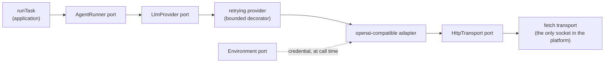

- **One adapter, one protocol.** `openai-compatible` speaks Chat Completions against a configured
  base URL. There is no vendor SDK in the dependency graph, and no vendor type above the port
  (ADR-033).
- **Retry is a decorator** with a hard attempt cap, capped exponential backoff, and `retry-after`
  honoured within that cap. Waiting is an injected `Sleep` (ADR-034).
- **Every call is one event lifecycle:** `LLMRequestStarted` → `LLMRequestCompleted`, or
  `LLMRequestStarted` + `LLMRequestFailed`. The completed payload carries provider, model, usage,
  `usageReported`, latency, attempt count and the provider's request id when it supplies one.
- **Failures are categorised, never narrated:** `auth`, `rate-limit`, `timeout`, `network`,
  `server`, `malformed-response`, `refused`, `unknown`, with a status code and retryability. A
  non-retryable failure ends the attempt as `provider-failed` and the task fails; the failure stays
  visible in the trace and in `TaskMetrics.failedLlmCalls` (ADR-035).

### 35.2 Configuration and credentials

`.ai/project.json` gains an optional `llm` block. Absent means the offline provider, so projects
created before Phase D keep working.

```json
{
  "llm": {
    "provider": "openai-compatible",
    "baseUrl": "https://api.example.com/v1",
    "modelId": "some-model",
    "credentialEnvVar": "EXAMPLE_API_KEY",
    "maxAttempts": 3,
    "timeoutMs": 60000
  }
}
```

The `llm` block is a **discriminated union**: selecting a real provider makes its base URL, model
and credential variable required by the type, so no call site needs an assertion.

Credentials are **references, never values**. Validation rejects a `credentialEnvVar` that is not
an environment-variable name or that looks like secret material, and rejects a base URL that embeds
credentials. The value is read through the `Environment` port at call time, used for one request,
and dropped. `ai doctor` reports _presence_ (name, length, and the last four characters) and never
the value; it performs **no network call** — a health check that spends money is not a health check.

This is the whole of the supported surface: one HTTP protocol, configured per project. There is no
multi-vendor routing, no fallback chain, and no vendor-specific tuning.

### 35.3 Token and cost semantics

Prices stay outside the provider adapter. Rates live in project configuration and are applied when
metrics are projected from events, so a provider adapter never computes money (ADR-007, ADR-031).

- A provider that reports usage yields it; the adapter normalises `prompt_tokens`,
  `completion_tokens` and `cached_tokens` (a **subset** of input, never added again — ADR-008).
- A provider that reports **no** usage yields `usage: undefined` and `usageReported: false`. The
  call is counted in `usageUnavailableCalls`, cost becomes incomplete, and the rendering says
  "usage unavailable". It is never rendered or recorded as zero.
- A model with no configured rate is **unpriced**: `costComplete: false`, `unpricedCalls` counts it,
  and `ai task cost` says the total is a lower bound. Unpriced is never free.
- Attempt counts are summed into `providerAttempts`, so retry cost is visible even when the calls
  that were retried produced no usage.

### 35.4 Approval resume semantics

Approval is a lifecycle, not a flag: **ask → grant → consume**, each step an event, with state
projected by the `ApprovalLedger` (ADR-037).

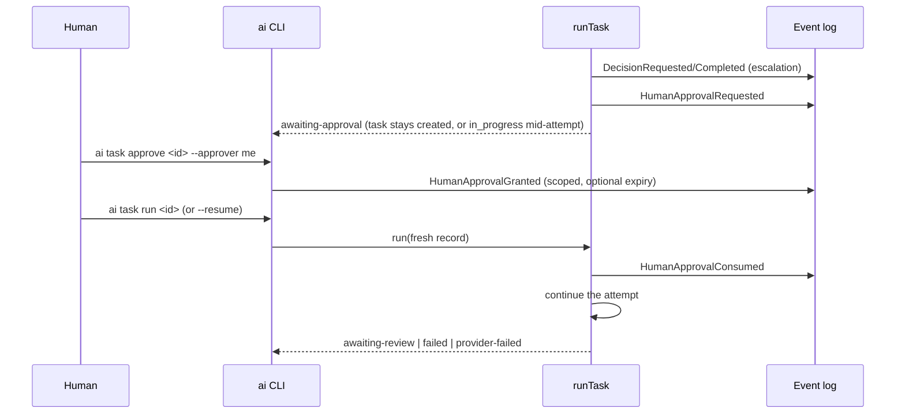

A grant is **scoped** (risk level, and either one operation or the whole task), **single-use**, and
may **expire** (absent expiry means it does not). At each gate the run resolves in a fixed order:
consume a usable grant → re-state an outstanding request → raise a new request and suspend. A later
gate _inside_ the same attempt is covered by the authority already established by a consumed grant,
but a gate exceeding that boundary suspends again: **an approval never widens what policy allows**.
A grant at a lower risk level, a narrower grant, an expired grant and a consumed grant are all
ignored — and a narrower grant does not count as an answer to a broader question.

Resuming is guarded: a task that is `in_progress` with no pending or granted approval is refused
with `INVARIANT`, because restarting work that was not suspended would fabricate history. A stale
task projection is refused with `CONFLICT` **before anything is spent** (ADR-038).

### 35.5 Concurrency: what is guaranteed, and what is not

The `AppendLock` port carries an explicit guarantee string (`none` | `local-process-and-file`). The
local adapter combines an in-process queue with an atomic exclusive-create lock file, and the JSONL
store reads its tail **and** appends inside the lock, so the loser of a race is rejected as
`CONFLICT` rather than writing a duplicate sequence.

Honest limits, stated because they matter:

- It coordinates **cooperating writers on one machine** with atomic exclusive create. It is **not**
  a distributed lock and provides nothing across machines.
- A lock older than `staleLockMs` (default 30s) is reclaimed so a crashed process cannot wedge a
  project; reclaim is best-effort, and the threshold is far larger than any append.
- Readers never take the lock, so reading is never blocked by writing.
- Append cost is linear in log size, because the tail is re-read under the lock. That is the price
  of the guarantee for a local JSONL log.

### 35.6 Still simulated, absent, or provider/sandbox dependent

- **The agent runtime is still simulated.** With a real provider configured it makes a real model
  call with real usage and real latency, and it performs a real read-only workspace listing and real
  task-contract verification — but it performs no engineering work. There is no agent framework and
  no autonomous loop (ADR-030 reports this as a warning).
- **No sandbox.** The only tool the runner uses is a workspace listing through the filesystem
  directly. Command execution, containment and capability enforcement remain Phase F.
- **No live end-to-end vendor verification** is part of the automated suite: that needs a key and
  spends money. The adapter's full path is covered offline by scripting the transport.
- **JEV is still absent, and still optional.** No decision in a Phase D run is answered by a
  decision provider; the `DecisionProvider` port is unchanged and unused (ADR-004).
- Still absent: context engine, engineering memory, ADR workflow, plugins, replay/checkpoint store,
  dashboard, `evals/`.

### 35.7 Layout added in Phase D

```
src/
├── ports/                # + http-transport, sleep, environment, append-lock
├── adapters/
│   ├── http/             # fetch transport — the platform's only socket
│   ├── llm/              # + openai-compatible provider, retrying decorator
│   ├── storage/          # + file append lock; JSONL store now locks and re-reads its tail
│   └── time/             # timer sleep (injected, never ambient)
└── application/          # + approval-ledger; run-task consumes grants; doctor exercises locking
```

CLI additions: `ai approvals`, `ai task approve <task-id> [--request <id>] [--expires-in <minutes>]
[--resume]`, and `ai doctor` now reports provider, credential presence, append coordination and
approval-ledger state.

---

## 36. Phase E status — the deterministic context engine

### 36.1 What the engine is, and what it deliberately is not

The Context Engine chooses **which files enter a prompt**, under an explicit token budget, and
records why. It is not RAG, not a vector index and not a document search system: there are no
embeddings, no model calls, and no learned weights anywhere in the pipeline. A selection is a
total function of the repository listing, the task text and the configuration, so the same state
produces the same selection byte for byte — and a selection can be re-derived from the log alone.

The boundary the port draws is the point of the phase:

- the **LLM provider never chooses files** — selection is not a prompt;
- the **engine never calls a model** — `ContextSelectRequest` has no provider in it, and no adapter
  may add one;
- **content and metadata are separate types** (`ContextSelection` vs `ContextBundle`), so a
  selection can never accidentally carry content into an event.

### 36.2 Pipeline

```
discover → classify → filter → signal → score → order → fit → record
```

| Stage    | What happens                                                                                                                                             |
| -------- | -------------------------------------------------------------------------------------------------------------------------------------------------------- |
| discover | `RepositoryReader` enumerates the workspace (bounded, no symlinks); `ChangeProvider` reports changed paths if it can                                     |
| classify | `test-file` \| `source-file` \| `config-file` \| `documentation` \| `adr`, by name                                                                       |
| filter   | gitignore, hard exclusions, credential-shaped paths and disabled kinds — all counted, never silent                                                       |
| signal   | observable facts: explicit reference, path token, filename token, changed, test link, import, neighbour, config, ADR, documentation, configured priority |
| score    | additive points per signal (§11.3); every point becomes a reason                                                                                         |
| order    | mandatory first, then score, then `ref`, then `kind` — a total order                                                                                     |
| fit      | greedy in ranked order, content-sized as it goes; nothing truncated, budget never exceeded                                                               |
| record   | `ContextSelectionStarted` then `ContextSelected`, against the task and the session                                                                       |

**Bounded by construction.** One hop of import expansion (not a transitive closure), at most
`MAX_IMPORT_SCAN_REFS` files read to resolve imports, an entry cap on the walk, and a per-file token
cap that is applied _before_ a file is read. Import expansion only reads files it could still select.

**Never read what cannot be selected.** A path is refused by name — credential shape, hard-excluded
directory, ignore rule, disabled kind — before any `read`. The tests assert this with a witness at the
I/O boundary rather than by inspecting the result.

### 36.3 Security: three layers with different authority

1. **Hard exclusions** (`node_modules`, `.git`, `.ai`, `dist`, … and credential-shaped names).
   Policy, not preference: neither a `.gitignore` negation nor an operator pattern can re-include a
   credential file, and the ordering that guarantees this lives in one function with one test suite.
2. **The workspace's `.gitignore`**, honoured with last-match-wins, `!` negation, trailing-`/`,
   leading-`/`, `*`, `?` and `**`. The implementation is a documented **subset**; what it does not
   implement is listed rather than silently approximated.
3. **Operator exclusions** from `.ai/project.json` (`context.exclusions`).

Repository text is treated as **untrusted data**. `AGENTS.md`, `CLAUDE.md`, READMEs and comments may
be context, but they never modify policy, budget, isolation or permissions — not by discipline, but
because nothing downstream of discovery reads file content for control. Tests assert that a hostile
file changes neither the selection it appears in nor the budget it ran under.

### 36.4 Scoring signals (v1)

| Signal                | Points | Meaning                                                       |
| --------------------- | ------ | ------------------------------------------------------------- |
| `explicit-path`       | 100    | the task named this exact path — the only way to be mandatory |
| `path-token`          | 45     | a path-shaped token from the task text is a prefix of the ref |
| `changed`             | 30     | changed in the working tree                                   |
| `filename-token`      | 24     | the filename shares a token with the task text                |
| `test-relationship`   | 20     | linked to a relevant file by the test convention              |
| `direct-dependency`   | 15     | imported by a relevant file (one hop)                         |
| `adr`                 | 12     | an ADR, when the task is about architecture or names it       |
| `documentation`       | 10     | documentation whose filename matches a task token             |
| `same-directory`      | 8      | shares a directory with a relevant file                       |
| `verification-config` | 6      | `package.json`, `tsconfig.json`, …                            |
| `configured-priority` | ±rule  | operator ranking adjustment (cannot create relevance)         |

The weights are ordered by how _explicit_ the evidence is. There is no tuning history behind the
numbers and this document does not pretend otherwise: they are starting points to measure against
task outcomes (§36.9), not empirical optima.

### 36.5 Token semantics

Two units, deliberately distinct:

- `candidateTokens` is the sum of **size-based estimates** over every scored candidate ("what was on
  the table"), computed without reading anything;
- `selectedTokens` is the sum of **content-based estimates** over the selected candidates (what this
  selection actually costs, and the number to compare against a provider's reported input tokens);
- `excludedTokens = candidateTokens − (size-estimates of the selected)`, so nothing is double counted.

Estimation is `bytes / bytesPerToken` (default 4), UTF-8 aware, and always labelled an estimate.
**Unknown token count is never reported as zero**, and no provider figure is ever invented.

### 36.6 Context events

`ContextSelectionStarted` (`selectionId`, `strategy`, `selectionVersion`, `budgetTokens`,
`configFingerprint`) and `ContextSelected` (the full selection: counts, token arithmetic, capability
report, `selectedRefs[]` with scores and reason codes, `excludedRefs[]` with one reason each).

Payloads carry **paths, codes and counters** — never text. `refsTruncated` says so when the recorded
lists were capped; the counts are always exact. An `LLMRequestStarted` carries the
`contextSelectionId` it was built from, which is what joins _which files were chosen_ to _what that
call cost_ without either side storing prompt text.

### 36.7 Git awareness, and honest degradation

`ChangeProvider` answers "what changed?" and reports **capability**, never an empty change set for a
question it could not answer: `no-vcs`, `not-a-repository`, `query-failed`, `disabled`. The trace
records which of these applied, so a reviewer can see that a selection was made without change
information instead of having to infer it. The provider is a plain `git status --porcelain -z` call
through a bounded, shell-free `ProcessRunner` port; paths are mapped to workspace-relative refs, and a
workspace outside its own repository root is reported as unavailable rather than guessed at.

### 36.8 CLI and doctor

```
ai task context <task-id> [--select] [--explain] [--json]
```

Reading shows what a previous run actually selected. `--select` performs and **records** a fresh
selection — explicit, because a plain read command must never append to the log by surprise. A
selection that does not fit exits non-zero and prints `OVER BUDGET`. Reading a task this scope does
not know about is a `NOT_FOUND` (exit 1), the same rule every reading command follows (§34.3).

`ai doctor` gained three **offline** checks: `context-config` (strategy/version must match this build,
or nothing recorded is attributable), `context-repository` (the workspace enumerates, ignore rules
load, change detection reports its capability), and `context-selection` — which runs a real selection
against a throwaway workspace containing `.env`, a private key and a secret-named directory, and
verifies that the referenced file is selected as mandatory, that no secret-shaped path survives, and
that an over-budget selection is refused with an empty bundle. No network, no provider, no writes to
the project's own log.

### 36.9 Evaluation baseline

Every selection records the numbers a later evaluation needs: `configFingerprint`, `strategy`,
`selectionVersion`, candidates considered, candidates selected, candidate tokens, selected tokens,
selection latency and budget overflows — joined to task outcome, cost and duration through the task
itself. This is a **baseline**, not a framework: no scoring of "usefulness" is claimed, and the metric
is named `contextSelectionRatio` (`selectedTokens / candidateTokens`) for exactly what it measures.

### 36.10 Still absent after Phase E

- **No embeddings, no semantic search, no repository index.** Selection is path- and text-token
  driven, which is weaker than a semantic ranker and is chosen deliberately for auditability.
- **No engineering memory as a candidate source.** `.ai/memory`, ADRs-as-memory, convention mining
  and previous-task artefacts are Phase G; the engine's candidate vocabulary is a closed set and an
  unproducible kind is not declared.
- **No context cache.** Selection reads a bounded number of files and caches nothing; a cache whose
  key did not include project, workspace, revision and selection version would be a correctness bug
  wearing a performance hat.
- **No JEV routing.** No JEV dependency, no JEV types, no JEV calls: the deterministic engine works
  with none installed, and the routing seam of §9 remains untouched. The future shape is still
  "deterministic candidate generation → JEV chooses among bounded strategies → deterministic selector
  executes".
- **No sandbox, no command execution, no autonomous agent**. The agent runtime is still simulated.
- **Not distributed.** Append coordination remains single-machine (§35.5).

### 36.11 Layout added in Phase E

```
src/
├── context/              # the domain: selection vocabulary, tokens, ignore policy,
│                         # matching heuristics, scoring, budget arithmetic, fingerprint
├── ports/                # + context-engine, repository-reader, change-provider, process-runner
├── adapters/
│   ├── repository/       # bounded read-only workspace walk
│   ├── git/              # change detection that degrades explicitly
│   └── process/          # the only place a subprocess starts: argv, no shell, bounded
└── application/          # + context-engine (pipeline), context-service (task → request)
```

---

## Appendix A — target source layout

Created in **Phase B**:

```
src/
├── core/                 # ids, clock, errors, validation  (no domain knowledge)
├── projects/             # Project
├── workspaces/           # Workspace + IsolationProfile
├── tasks/                # Task + lifecycle
├── decisions/            # Decision, risk, policy, DecisionProvider port, routing
├── sessions/             # AgentSession
├── observability/        # events, usage, cost, budget, metrics
├── index.ts              # existing smoke proof — unchanged (ADR-014)
└── result.ts             # existing deterministic CheckResult utilities
```

Created in **Phase C**:

```
src/
├── ports/                # EventStore, TaskRepository, AgentRunner, LlmProvider, scope,
│                         # + HttpTransport, Sleep, Environment, AppendLock
├── adapters/
│   ├── storage/          # JSONL event store (locked), file task repository, layout, append lock
│   ├── config/           # validated .ai/project.json (including the llm block)
│   ├── llm/              # deterministic offline provider + openai-compatible adapter + retry
│   ├── http/             # fetch transport (the only socket)
│   ├── time/             # timer sleep
│   └── agent/            # simulated agent runner (NOT an agent framework)
├── application/          # runtime (composition root), services, ledger, trace, run, doctor
└── cli/                  # args, io, render, help, commands/, main, run (process shim)
```

Added in later phases (not created yet):

```
src/
├── ai/                   # Phase E  (context/, tools/)
├── security/             # Phase F  (sandbox, grants, command execution)
├── memory/               # Phase G
└── plugins/              # Phase H
```

## Appendix B — invariants checklist (review aid)

- [ ] No module in `core/` or the domain imports an adapter or vendor SDK.
- [ ] Every entity id is branded; every timestamp is an injected ISO-8601 UTC string.
- [ ] Time and ids come from injected dependencies — no ambient `Date.now()` in domain logic.
- [ ] The platform runs with no JEV, no LLM, no network, and no database.
- [ ] Every decision that changed an outcome is recorded, with the layer that decided it.
- [ ] Every metric is derived from events; no human-entered numbers.
- [ ] Money is integer micro-USD; money arithmetic is exact under summation.
- [ ] Cached tokens are never double-counted.
- [ ] Unknown models report cost as _unavailable_, never `$0`.
- [ ] Budget evaluation is pure and lives outside every provider adapter.
- [ ] Policy evaluation is pure; most-restrictive-wins; default is never `allow`.
- [ ] Effective risk = max(declared, baseline) — declared risk cannot lower inherent danger.
- [ ] High/critical operations require a human approval record, scoped and non-transferable.
- [ ] Events carry references and metadata; never secrets, never raw prompts.
- [ ] A credential is referenced by the name of an environment variable; no credential value is
      stored, logged, recorded, or included in an error message.
- [ ] A provider that reports no usage is recorded as _unavailable_, never as zero.
- [ ] Retry is bounded, backoff is capped, and the attempt count is recorded.
- [ ] A vendor's error text never reaches an event, a trace or an operator-facing message.
- [ ] An approval grant is scoped, single-use and expiring; a consumed grant is never reused, and a
      grant can never widen what policy allows.
- [ ] Two writers cannot append the same sequence; the lock's guarantee is stated, not implied.
- [ ] A stale task projection is refused before any provider call is made.
- [ ] Isolation defaults are restrictive; `enforcement` states the truth.
- [ ] Memory is project-scoped; AI-authored knowledge stays `proposed` until a human accepts.
- [ ] ADRs are human-decided; AI may draft, never accept.
- [ ] Task → Session → Decision/Context/LLM/Tool/Test → Event is unbroken.
- [ ] Task status only changes through the declared transition table.
- [ ] No empty speculative directories; every directory has justified code in it.
